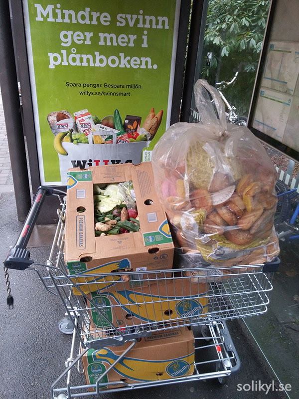
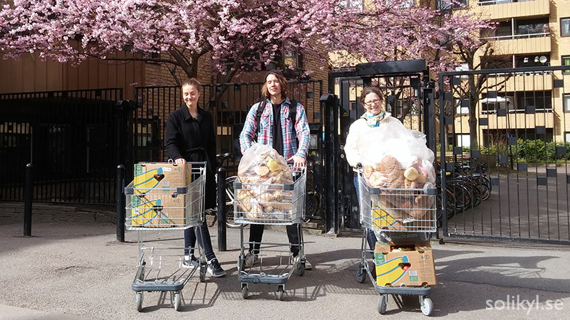

Am schwierigsten ist momentan wahrscheinlich der Aufbau weiterer Kooperationen mit Supermärkten bzw. Lebensmittelläden. Entweder haben sie zu viel Angst wegen der Lebensmittelrichtlinien, oder es gibt für sie keinen Anreiz ihre Lebensmittelverschwendung zu reduzieren bzw. ist das für sie keine Priorität.

Das betrifft natürlich nicht alle Läden (sonst gäbe es die bestehenden Kooperationen nicht) und kleinere Läden sind der Sache eher positiv eingestellt, aber an die großen Ketten muss man sehr sachte rangehen. Was alle gemeinsam haben ist, dass ignorieren und ausweichen und ab und an wird man auch direkt angelogen: "Bei uns wird nichts weggeschmissen". Das ist jedoch unmöglich für einen Supermarkt, egal wie sehr sie es zu verhindern versuchen.

Aber uns ist auch aufgefallen, dass manche einfach Angst vor dem foodsharing Modell haben und davor dass sie eventuell verantwortlich gemacht werden, falls doch jemand krank wird. Was in der Realität sehr unwahrscheinlich ist, da die Lebensmittel immer von der Gemeinschaft kontrolliert werden und die beteiligten Personen immer die nötigen Vorsichtsmaßnahmen ergreifen um die Sicherheit der Lebensmittel zu gewährleisten.

Im deutschprachigen foodsharing Raum und auch bei foodsharing Edinburg (und wahrscheinlich bei anderen von denen ich nichts weiß) ist der Lösungsansatz Rechtsvereinbarungen zwischen den Foodsavern und den spendenden Betrieben zu unterzeichnen, sodass die Betriebe von jeglicher Verantwortung befreit werden.

 Während einer Lebensmittelrettungsaktion sind wir auf die Greenwashing Propaganda einer größeren Supermarktkette gestoßen. Sie prahlen damit, wie wenig sie wegschmeißen. Dabei arbeiten sie nur mit etablierten Wohlfahrtseinrichtungen, denen sie etwa 0,8% ihrer Lebensmittelabfälle spenden. Sie hatten kein Interesse mit uns zu kooperieren

Das ist eine Lösung, die man hier in Göteborg noch diskutieren wird. Dabei muss aber auch eine bessere Kommunikation, mit einer verbesserten Website und Infobroschüren, stattfinden, um den interessanten Betrieben jegliche Zweifel und Ängste zu nehmen.

Persönlich mag ich diese Strategie: Sich bemühen alle Zweifel auszulöschen und dabei feststellen, ob diese legitim waren oder doch nur schlechte Ausreden. Falls das letztere zutrifft sollten wird auf jeden Fall weitermachen und wenn nötig, auch öffentlich anprangern. Denn immerhin bieten wir ihnen einen Dienst an, der sie Kosten für die Müllentsorgung einsparen lässt. Und dabei sorgen wir auch dafür, dass mit den Lebensmittel korrekt umgegangen wird und dass sie im Fall der Fälle nicht zur Verantwortung gezogen werden können.

Es gibt keine Ausrede mehr, mit der man das Verschwenden von essbaren Lebensmitteln noch rechtfertigen kann!! Und der Kampf lohnt sich. Wir haben tatsächlich schon gesehen, dass unsere Hartnäckigkeit dazu geführt hat, dass der Supermarkt angefangen hat Lebensmittel einer anderen, mehr etablierten Ngo zu spenden.

 Langsam aber stetig wächst die Anzahl der foodsaver. Das foodsaving tool von yunity hat die Sache vereinfacht

Eine weitere, aber meines Erachtens angenehmere, Herausfordung ist Menschen zu erklären, dass wir keine Wohlfahrtsorganisation sind, die ihnen einen Dienst bietet, sondern, dass wir davon abhängig sind, dass die Menschen selbst mitmachen.

Für die meisten ist es klar, dass wir nicht Gewinn orientiert arbeiten. Weniger klar ist jedoch, dass man einfach mitmachen und einen Wandel mitgestalten kann. Um das zu vermitteln braucht man Zeit und muss die Leute persönlich treffen. Ein guter Ort ist dafür der erste öffentliche Kühlschrank, an dem es jetzt regelmäßig Verteilungen gibt.

Manche Menschen haben keine Zeit oder andere Einschränkungen und können so selbst nicht helfen. Deswegen ist es gut, dass man einfach zum Kühlschrank kommen kann um sich Lebensmittel zu holen, die andernfalls weggeschmissen worden wären.

Other people are willing to participate, but bringing them in is also a matter of making it easy for them to participate. Barriers for entry should be low. The more, the merrier.

In this sense, the foodsaving tool developed by yunity has been useful. In the next post I will present the kind of tools we have been using here in Gothenburg and discuss how they’ve helped us in creating community and networks, while prototyping a way to organize on a larger scale to reduce food waste while sharing.