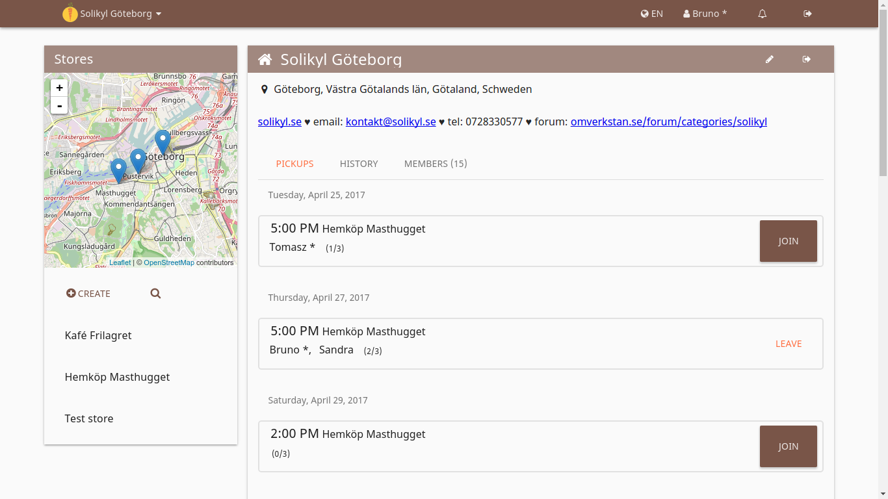

Das ist wahrscheinlich der eher theoretische Teil, verglichen verglichen mit den praktischen Aktivitäten des Essenrettens und -teilens, aber trotzdem mag ich diesen Teil am Liebsten. Ich war schon immer sehr enthusiastisch was die Art und Menge der Organisation angeht, die, ohne formelle Hierarchien, Verbindung schafft durch die digitale Plattform.

Es ist besonders wichtig, dass wir eine Plattform haben, die nicht von einer Profit-Unternehmen kontrolliert wird und die keine Bedingungen stellt, wie die Leute miteinander interagieren, was normalerweise der Fall bei Technologie Unternehmen der sogenannten Sharing Economy ist.

Wahres Teilen findet dann doch eher auf einer Plattform statt, von der Gemeinschaft gebaut und kontrolliert, von einer Bewegung und den Leuten, die sie nutzen.

Ein Beispiel aus Schweden ist die Mitfahrgelegenheitsplattform [skjutsgruppen.nu](http://skjutsgruppen.nu/), ein anderes Bekanntes, das wahrscheinlich die meisten Leser dieses Blogs kennen, ist [foodsharing.de](https://foodsharing.de/). Als ich mit foodsharing in Göteburg began, dachte ich, wir könnten die foodsharing Plattform nutzen, was aber aus einigen Gründen nicht funktionierte: Es ist noch nicht open-source (soweit ich weiß denken die Entwickler, dass der Code noch nicht gut genug ist, um ihn zu veröffentlichen) und nur für deutschsprachige Länder verfügbar.

Trotzdem, man braucht keine komplette, neue Plattform um eine Lebensmittelretter-Organisation aufzubauen, wo man lebt. Der gängigste Weg sich mit Gleichgesinnten auszutauschen und Leute zu erreichen die Interesse haben, ist durch eine facebook Gruppe.

Natürlich gibt es einige Nachteile an facebook - ganz neben dem dubiosen Tatsachen, dass es all unsere persönlichen Daten sammelt, Klicks und Likes um sie Leuten zu verkaufen, die uns als Konsumenten oder Wähler einplanen, ist es nicht das geeignetste Werkzeug um Essen zu retten und Foodsaver zu organisieren. Und natürlich können so manche Dinge einfach unbemerkt untergehen.

Der wohl größte, vielleicht auch einzige Vorteil an facebook ist die Anzahl der Leute, die es nutzen. Also es ist einfacher "Marketing" zu betreiben und ein größeres Publikum zu bekommen.

Es hat sich aber als besser erwiesen [unser eigenes Forum](http://omverkstan.se/forum/categories/solikyl) zu erschaffen, um Solikyl (foodsharing in Göteburg) zu organisieren. On top of that, we put up a website ([solikyl.se](http://solikyl.se/)), first as a Wordpress blog and later registering the domain name. The website was also an important source of information about the project and the foodsaving idea in Gothenburg, as well as the way for people to contact us.

 *yunity's foodsaving tool*

Recently we have been able to test and use yunity's [foodsaving tool](https://foodsaving.world), which helps us coordinate more easily who is doing the pickups, when and where. Although it is still under development, it has the basic features that we need and it has worked fine so far!

Another big advantage is that we could bring new people to participate in our regular pickups, which is actually a really important way to create engagement and make people feel a part of it. In the future, I hope that we can have the foodsaving tool integrated in our website, and further developed it to have a forum and chat options, and not least it would be awesome to have a functionality like the one in foodsharing, where people can share food in a peer-to-peer fashion.

As grassroots food waste activists we do not have yet the human resources and connections to develop this software on our own here in Gothenburg, but thanks to work of like-minded people using open-source and collaborating on the internet, we can adopt new tools to achieve more efficient organization on a larger scale, and hopefully contribute to software development in the future as well.

This is certainly an advantage that the collaborative movement has compared to profit-seeking counterparts still working with a scarcity-based mentality of enclosing the knowledge and information commons. Collaboration works better!

yunity’s foodsaving tool, in particular, has been crucial in preparing the ground for expanding foodsaving in Gothenburg. And although a platform and digital tools might be necessary to build food-rescuing and sharing on a larger scale, they are not sufficient and other ingredients might be necessary.

The next and final post will be about our strategies for the future of Solikyl, trying to reduce food waste and increase sharing as much as possible!