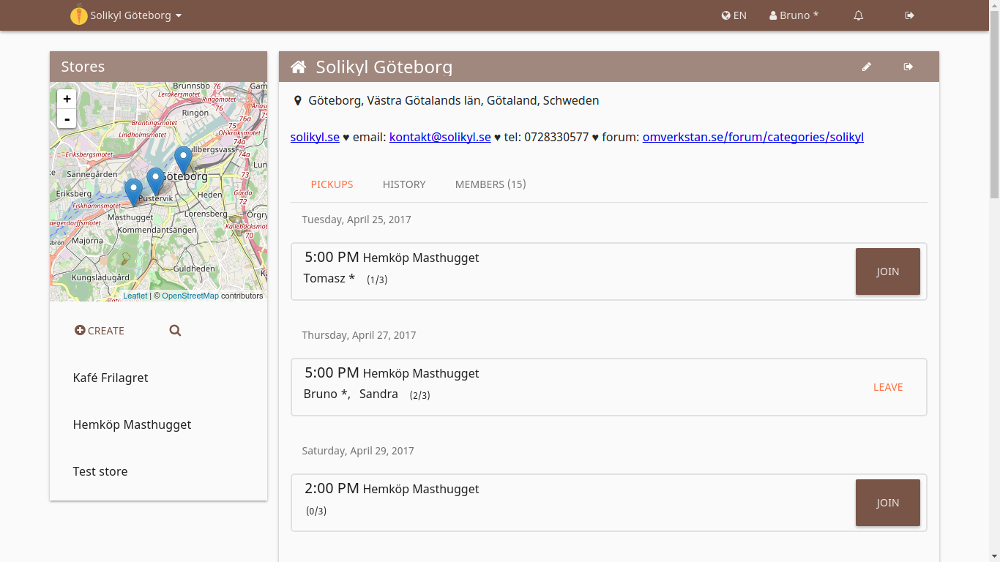

This is probably the most abstract part, comparing to the hands-on activity of rescuing and sharing food, but also the one I’m most passionate about. I've always been very enthusiastic about the level and scale of organization that networks, with no formal hierarchies, can achieve by using digital platforms.

It is especially important that this can happen without a for-profit company controlling the platform and setting the framework of how people can interact, which is usually the case for tech companies of the so-called sharing economy.

Real sharing, however, can take place in a platform built and controlled by the community, by a movement and the people who use it.

One example here in Sweden is the ride-sharing platform [skjutsgruppen.nu](http://skjutsgruppen.nu/), but another famous one, which most of the readers on this blog know about, is [foodsharing.de](https://foodsharing.de/). When I began foodsaving in Gothenburg I thought that we could start using foodsharing’s platform, but it was not possible for a number of reasons: the fact it is not open-source yet (as I understood, developers think the code is still not good enough to be released yet) and that it’s available only to the German-speaking public.

However, you do not need a whole platform to start organizing food-rescuing where you live. The most common way to start organizing with your peers and reaching out to people interested is by creating a Facebook group.

Of course, there is a number of inconvenient things about Facebook – besides the shadiest fact that it collects your personal data, your views and preferences in order to sell them to whomever wants to target people as consumers or voters, it is not the most appropriate tool for sharing food and coordinating the work of foodsavers. Things will also tend to pass unnoticed in its timeline.

Facebook’s biggest and perhaps only advantage is the number of people there, meaning it’s easier to do some “marketing” and try to reach out to a wider public.

However, to communicate and organize Solikyl (foodsharing in Gothenburg) it turned out better to create [our own forum](http://omverkstan.se/forum/categories/solikyl). On top of that, we put up a website ([solikyl.se](http://solikyl.se/)), first as a Wordpress blog and later registering the domain name. The website was also an important source of information about the project and the foodsaving idea in Gothenburg, as well as the way for people to contact us.

 *yunity's foodsaving tool*

Recently we have been able to test and use yunity's [foodsaving tool](https://foodsaving.world), which helps us coordinate more easily who is doing the pickups, when and where. Although it is still under development, it has the basic features that we need and it has worked fine so far!

Another big advantage is that we could bring new people to participate in our regular pickups, which is actually a really important way to create engagement and make people feel a part of it. In the future, I hope that we can have the foodsaving tool integrated in our website, and further developed it to have a forum and chat options, and not least it would be awesome to have a functionality like the one in foodsharing, where people can share food in a peer-to-peer fashion.

As grassroots food waste activists we do not have yet the human resources and connections to develop this software on our own here in Gothenburg, but thanks to work of like-minded people using open-source and collaborating on the internet, we can adopt new tools to achieve more efficient organization on a larger scale, and hopefully contribute to software development in the future as well.

This is certainly an advantage that the collaborative movement has compared to profit-seeking counterparts still working with a scarcity-based mentality of enclosing the knowledge and information commons. Collaboration works better!

yunity’s foodsaving tool, in particular, has been crucial in preparing the ground for expanding foodsaving in Gothenburg. And although a platform and digital tools might be necessary to build food-rescuing and sharing on a larger scale, they are not sufficient and other ingredients might be necessary.

The next and final post will be about our strategies for the future of Solikyl, trying to reduce food waste and increase sharing as much as possible!