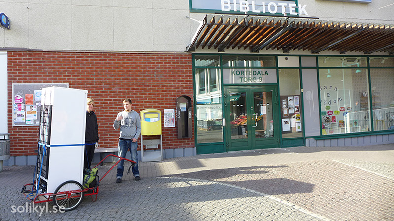
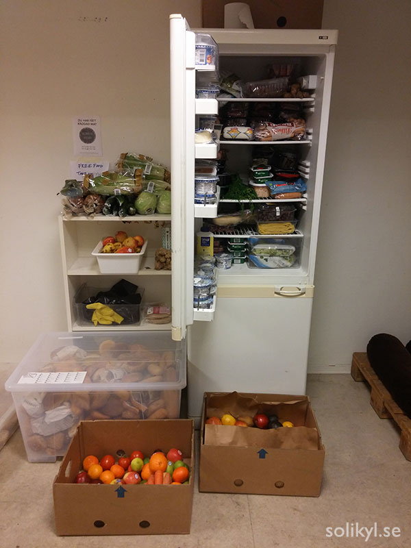

In den vergangenen Beiträgen schrieb ich über Solikyl, die foodsharing Initiative in Gotheburg, über Schwierigkeiten und über die Computerprogramme, die wir nutzen um uns zu organisieren und auszutauschen. Dieser letzte Beitrag behandelt die Strategien und Visionen, die wir für die Zukunft haben.

Die Vision ist natürlich solidarische Kühlschränke in der Stadt zu verteilen um mehr Betriebe dazu zu bringen mit uns zu kooperieren und letzendlich die Lebensmittelverschwendung sichtbar einzudämmen. Doch es gibt Wege und Wege dies zu tun. Es gibt weder den Bedarf ein Geschäft daraus zu machen, noch es als Wohltätigkeitsorganisation für die Ärmsten aufzuziehen, dies zieht nur stigmatisierende Grenzen mit sich.

Von Anfang an haben wir, die Organisierenden, diese Initiative nicht als eine von-oben-herab-Organisation oder als Geschäftsmodell gesehen. Eigentlich brauchen wir gar nicht so viel Geld (alle unserer Ausgaben haben wir bisher mit Pfandeinnahmen von unserem ersten solidarischen Kühlschrank gedeckt). Natürlich benötigen wir Ressourcen, die wichtigsten sind Zeit, Fähigkeiten und Engagement von Menschen.

Dinge wie z. B. Kühlschränke, benutzt und doch voll funktionsfähig, sind auch als Spende erhältlich in dieser im Überfluss schwimmenden Gesellschaft. Daher ist es nur eine Frage diese zu finden.

Bis jetzt bekamen wir diese über Facebook-sharing-Gruppen und ähnliche Spenden-Websites. Auch Orte gibt es genügend. Daher ist es nur eineFrage der Vernetzung - die richtigen Orte finden und mit den richtigen Leuten reden die ähnliche Werte teilen. Nun, wie bereiten wir die Grundlage um solche Dinge in größerem Maßstab zu tun?

 *Solidarische Kühlschränke and Orten aufstellen, die eh schon auf das Teilen eingestellt sind; eine Bibliothek
 

Eine besondere Strategie ist, dass wir in Partnerschaft mit der Stadt arbeiten. Wir diskutieren die Möglichkeit die ausrangierten, noch funktionsfähigen Kuhlschränke von den Abfallstationen zu bekommen und diese an öffentliche Orte, wie Bibliotheken zu stellen. Einige legale Fragen scheinen nun geklärt zu sein.

Wir wissen, dass die Orte, an denen die Kühlschränke stehen nicht für die Lebensmittelsicherheit von Foodsharing auf ihren Grundstücken verantwortlich sind. Ebenfalls wissen wir, dass Spenderbetriebe nicht für die Lebensmittel, die in den Kühlschränken und Foodsharing-points landen haftbar sind. Daher arbeiten wir derzeit an Kommunikationsmaterial um zukünftige Kooperationen anzusprechen (siehe auch [part 2](/blog/2017/04/21/foodsharing-gothenburg-part2)).

Schlussendlich, wenn alle Teile des Puzzels zusammengebracht sind werden wir die Bedingungen, um Foodsharing in Gotheburg auf dezentralisierte Art und Weise zu vergrößern und ohne überwältigende Mengen an Arbeit für die Kerngruppe zu erfordern geschaffen haben.

Solikyl wird nur die Software bereitstellen (siehe auch [part 3](/blog/2017/04/27/foodsharing-gothenburg-part3)), Wissen, Kontakte, Unterstützung usw. für lokale Nachbarschaften, die anfangen möchten Lebensmittel zu retten

Let me give you an example about what creating a decentralized solidarity infrastructure means. Last time I was at the transition workshop, the place where our first and most “active” fridge is, I could observe people coming and going, not only to get some food, but also to leave stuff on their own account.

One guy had just come from his dumpster-diving tour with some bread and sausages, while a woman came later with some snacks that were donated directly from a distributor, because the best-before date on these snacks had expired. I might have seen these people there before, but I did not know them, and they were not among the foodsavers who contacted us to pick up food at the store, using the foodsaving tool.

What happens here is that this food sharing point, with the fridge, the shelves and the big IKEA boxes (yes, so Swedish...) where we have bread constituted a very basic infrastructure that people could use to engage in the act of sharing whatever food excess they have or find.

There is no need for constant supervision of the fridge by any kind of formal organization (a company, a charity or public authorities), which would be responsible for the giving and taking happening on this food sharing point. There is no need either for a boss, whether from a company or from a non-profit, to organize or dictate how these interactions are going to take place.

This is actually one of the most efficient ways we believe there is to fight food waste, and perhaps more importantly, this kind of model promotes real sharing and is open enough to empower people, giving them the tools and knowledge to be active agents of change, and not merely limiting them to be passive consumers or receivers of charity.

I’m looking forward to read other contributions on this blog and to get to know more about similar initiatives in other cities!