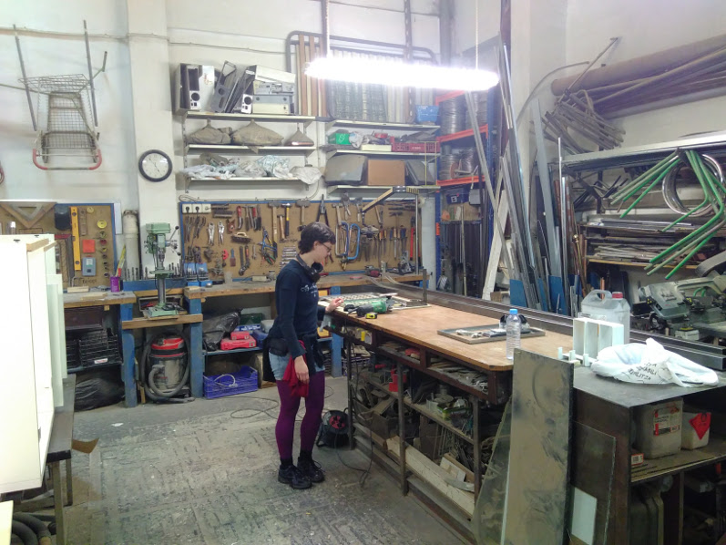
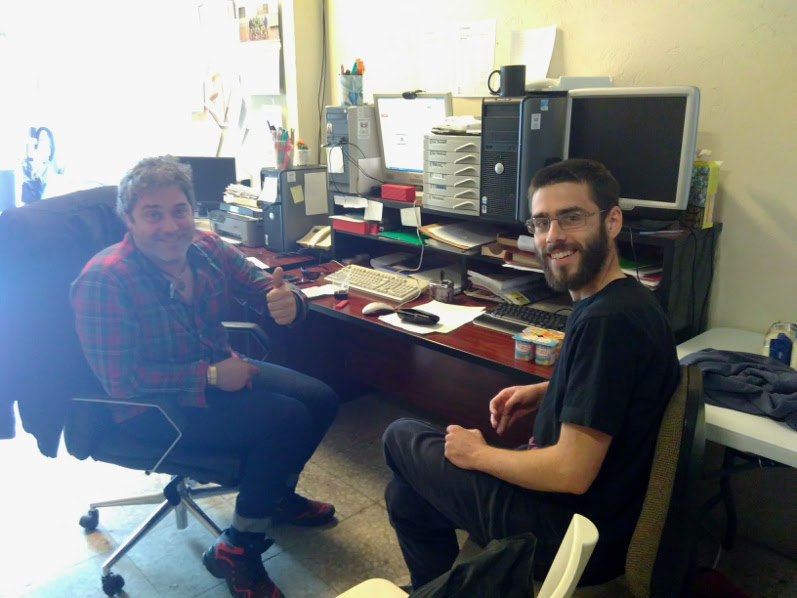

Leire und ich (Unai) haben die Energie von foodsharing Kopenhagen gesehen und wollten das auch hier in Bilbao ausprobieren. Etwa Ende 2016 haben wir ein Meeting bei [Sarean](https://www.facebook.com/sareangunea/) arrangiert, das zwei weitere Leute angezogen hat: Ione und Laura.

Wir haben beschlossen eine [Facebook Gruppe](https://www.facebook.com/groups/1853289058224368/?ref=bookmarks) zu gründen, um Leute einzuladen und ein weiteres Meeting zu halten, sobald mehr Leute erreichbar sind. Das zweite Treffen hat nie stattgefunden; zum Glück aber kannte Laura Joachim (von [yunity](https://www.yunity.org)) und er hat vorgeschlagen, dass wir bei ein paar [Online Meetings](https://drive.google.com/open?id=0B0c-rM4MZX0XdERVTy1IVUN0aVU&noprocess) teilnehmen, wo wir die Basics von foodsharing kennenlernten.

Joachims Ratschlag befolgend wagten wir den ersten Schritt: [Flyer übersetzen](https://drive.google.com/open?id=0B0c-rM4MZX0Xc1dzWHFvN2VHUEE&noprocess), [Betriebe ansprechen](https://drive.google.com/open?id=1IPgyuLC2Sjsz7vnXTh-D636wObI_kISLdsegsF9TU1U&noprocess), nach möglichen Fair-Teiler Orten suchen und einige Kontakte knüpfen, mögliche Orte kontaktieren, die Platz für Präsentationen, Workshops und das Bauen eines Fahrradanhängers bieten.

 *Janina in Recrea2, wo wir zwei Wochen später an dem Fahrradanhänger arbeiten.*

Joachim plante Ende März mit Janina nach Bilbao zu kommen, um die Bewegung mit zu starten. [Und das haben sie gemacht!](https://yunity.atlassian.net/wiki/display/FSINT/Kickstarting+foodsharing+Bilbao)

The first pickup ever took place at Panadería Buenos Aires a couple of days before their arrival, but once they arrived everything speed up: we organised an [intro meeting](https://www.facebook.com/events/183695715476690/) at [Bilbiko Kultur Etxea](https://www.facebook.com/bilbikokulturetxea/), we established a collaboration with [Ecorganic](https://www.facebook.com/pages/Ecorganic-Bilbao/1710629755857150) and started daily pick-ups (except for Sunday), we half-built the bike trailer at [Recrea2](https://www.facebook.com/Recrea2.Bilbao/), we made some contacts such as [Karmela squat](https://www.facebook.com/Karmela-1029527180427399/) or Álvaro, from [Nevera Solidaria](https://www.facebook.com/neverasolidaria/). It was a highly productive yet super relaxed fortnight. Thanks a lot guys!

 *Alvaro and Unai.*

Once the yunity team left things slowed down but have kept running ever since. The collaboration with Ecorganic is getting stronger and we’ve only missed one pick-up; four people have signed the [liability contract](https://drive.google.com/open?id=0B0c-rM4MZX0XUWs3b2N2QkZnS0U&noprocess) and have done at least one pick up. On the other hand, the collaboration with Panadería Buenos Aires is really weak because they do not have leftovers anymore. We have weekly foodshare events at Karmela and Bilbiko Kultur Etxea. We have contacted big supermarkets such as Lidl and ALDI. We are going to present Foodsharing Bilbao and prepare food in an event organised by the Space Exchange Network and at a neighbourhood assembly. We have been invited to organise a Disco Soup in Sarean that might take place soon or after this summer. We will be live on air soon in a local radio station. We are active!

The movement is still a baby, but we are in no rush to grow. Everything happens when it has to happen :)