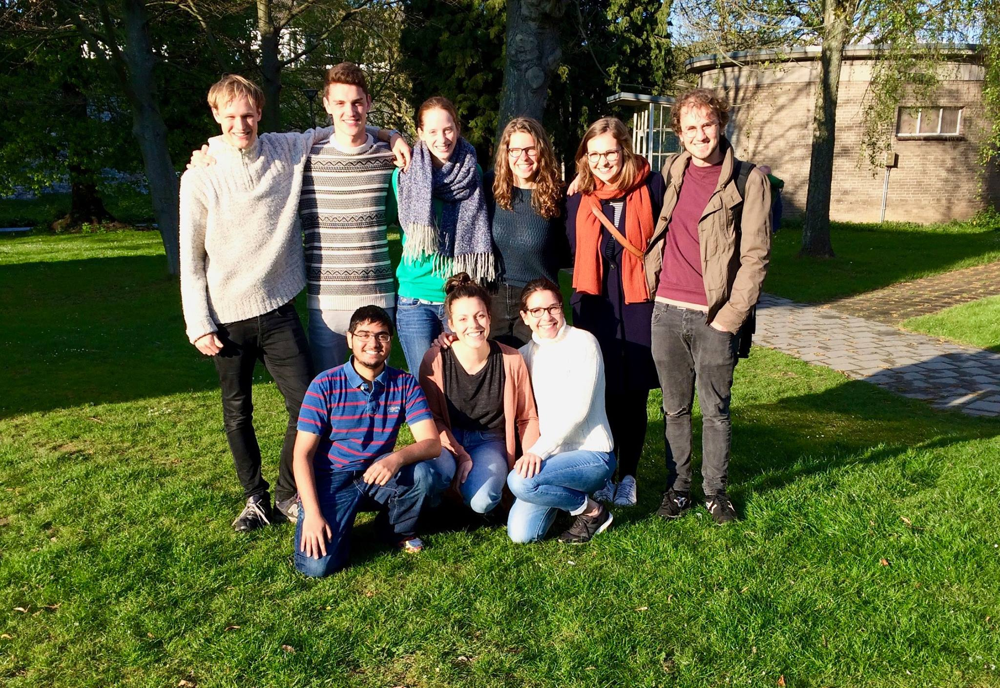

Die Idee mit Foodsharing in Maastricht anzufangen kam im Januar 2017. Nachdem wir es auf Facebook veröffentlicht haben, haben wir direkt Hilfe von der studentischen Nachhaltigkeitsabteilung der Maastricht University, dem [Green Office](https://www.greenofficemaastricht.nl/), erhalten, das Studenten-Initiativen unterstützt, um die Nachhaltigkeit der Universität zu verbessern.

Die Zeit war reif - die Universität hat einen Wettbewerb für die Studenten veranstaltet, um die beste Idee zur Verbesserung des Lebens in der Universität zu finden. Wir haben mit Foodsharing teilgenommen, und nach einigen Workshops und zwei runden waren wir die glücklichen Gewinner vom Preisgeld und der Unterstützung der Universität.

This contest gave us the amazing possibility to secure a room, in which we can store the saved food, and to be able to generally cooperate with the university. After the finals, everything went very quick. Two weeks later we got a small room in a university building in the center of Maastricht. Via Facebook we got several donations of second-hand fridges and of a shelf.

The second part, building up a team, showed how many interested and motivated students live in Maastricht. Together with the Green Office, we organized an information evening to gather interested people and to raise awareness of the initative in Maastricht. Through this event, we met our first great team members who are now - half a year later - still an important part of our team.

We created a [Facebook group](https://www.facebook.com/FoodSharingMaastricht/) and later a page where step by step, new people texted us to become foodsavers. However, until that point we did not have any cooperations with supermarkets. We decided to first organize the room and a team in order to really be able to manage pick-ups.

It was not as easy as we thought to convince supermarkets to cooperate with us. The first ones all denied. Smaller supermarkets always argued that they do not have any food waste at all (which is hard to believe) or that they use it already for other purposes (which is great). However, the biggest fish, large supermarkets, do not yet cooperate at all. They fear about their image, about additional work they have to do and are in general not open to a small student initiative and their activities. It is very frustrating to see that many people and companies in the Netherlands are not yet ready to fight against food waste.

Therefore, after the summer break, we want to focus more on awareness raising campaigns and events, we want to further grow in order to reach more people and to gain the power to convince also larger companies to donate their food waste. Only if enough customers are aware of the situation the pressure on supermarkets will be high enough to make them change their minds.

Recently, we picked up food from three smaller supermarkets on a regular basis and we started to cooperate with the food supplier of the university, which already greatly improves the sustainability of our university. On a national level, we just joined the Dutch-wide Foodsharing foundation, which was also just recently founded. It is great to see that more and more Dutch cities are involved and we hope the initiative will spread further around the globe.

(The Green Office published [an article](https://www.greenofficemaastricht.nl/single-post/2017/04/18/FoodSharing-Maastricht-Chasing-away-food-wastage) concerning this initiative on their own website in April 2017)