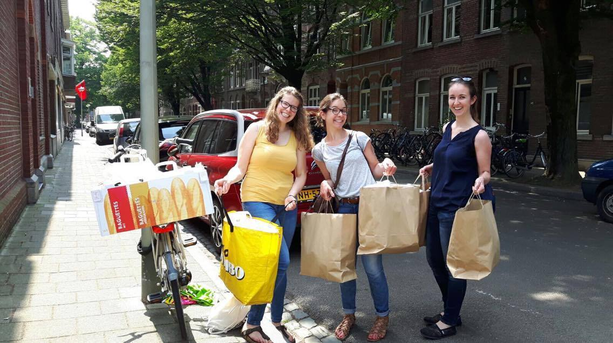

Die Idee mit Foodsharing in Maastricht anzufangen kam im Januar 2017. Nachdem wir es auf Facebook veröffentlicht haben, haben wir direkt Hilfe von der studentischen Nachhaltigkeitsabteilung der Maastricht University, dem [Green Office](https://www.greenofficemaastricht.nl/), erhalten, das Studenten-Initiativen unterstützt, um die Nachhaltigkeit der Universität zu verbessern.

Die Zeit war reif - die Universität hat einen Wettbewerb für die Studenten veranstaltet, um die beste Idee zur Verbesserung des Lebens in der Universität zu finden. Wir haben mit Foodsharing teilgenommen, und nach einigen Workshops und zwei runden waren wir die glücklichen Gewinner vom Preisgeld und der Unterstützung der Universität.

Dieser Wettbewerb gab uns die unglaubliche Möglichkeit, einen Raum zu haben in dem wir die geretteten Lebensmittel lagern können, und generell in der Lage zu sein mit der Universität zu kooperieren. Nach dem Finale ging alles sehr schnell. Zwei Wochen später bekamen wir einen kleinen Raum in einem Universitätsgebäude im Zentrum von Maastricht. Über Facebook haben wir mehrere Spenden gebrauchter Kühlschränke und einem Regal bekommen.

Der zweite Teil, ein Team aufzubauen, zeigte wie viele interessierte und motivierte Studenten in Maastricht leben. Gemeinsam mit dem Green Office haben wir einen Informationsabend organisiert um interessierte Menschen zu versammeln und die Initiative in Maastricht bekannter zu machen. Durch diese Veranstaltung trafen wir unsere ersten großartigen Teammitglieder, die jetzt, ein halbes Jahr später, noch ein wichtiger Teil unseres Teams sind.

Wir haben eine [Facebook Gruppe](https://www.facebook.com/FoodSharingMaastricht/) und später eine Seite erstellt, auf der sich neue Leute nach und nach bei uns meldeten um foodsaver zu werden. Bis dahin hatten wir jedoch keine Kooperationen mit Supermärkten. Wir hatten uns entschieden zuerst den Raum und ein Team zu organisieren, um wirklich in der Lage zu sein Abholungen zu bewältigen.

It was not as easy as we thought to convince supermarkets to cooperate with us. The first ones all denied. Smaller supermarkets always argued that they do not have any food waste at all (which is hard to believe) or that they use it already for other purposes (which is great). However, the biggest fish, large supermarkets, do not yet cooperate at all. They fear about their image, about additional work they have to do and are in general not open to a small student initiative and their activities. It is very frustrating to see that many people and companies in the Netherlands are not yet ready to fight against food waste.

Therefore, after the summer break, we want to focus more on awareness raising campaigns and events, we want to further grow in order to reach more people and to gain the power to convince also larger companies to donate their food waste. Only if enough customers are aware of the situation the pressure on supermarkets will be high enough to make them change their minds.

Recently, we picked up food from three smaller supermarkets on a regular basis and we started to cooperate with the food supplier of the university, which already greatly improves the sustainability of our university. On a national level, we just joined the Dutch-wide Foodsharing foundation, which was also just recently founded. It is great to see that more and more Dutch cities are involved and we hope the initiative will spread further around the globe.

(The Green Office published [an article](https://www.greenofficemaastricht.nl/single-post/2017/04/18/FoodSharing-Maastricht-Chasing-away-food-wastage) concerning this initiative on their own website in April 2017)