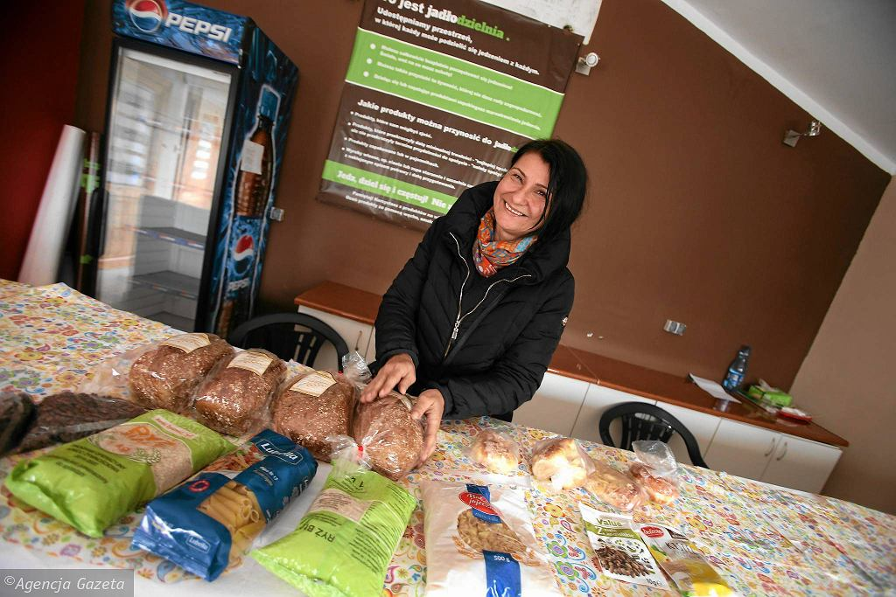
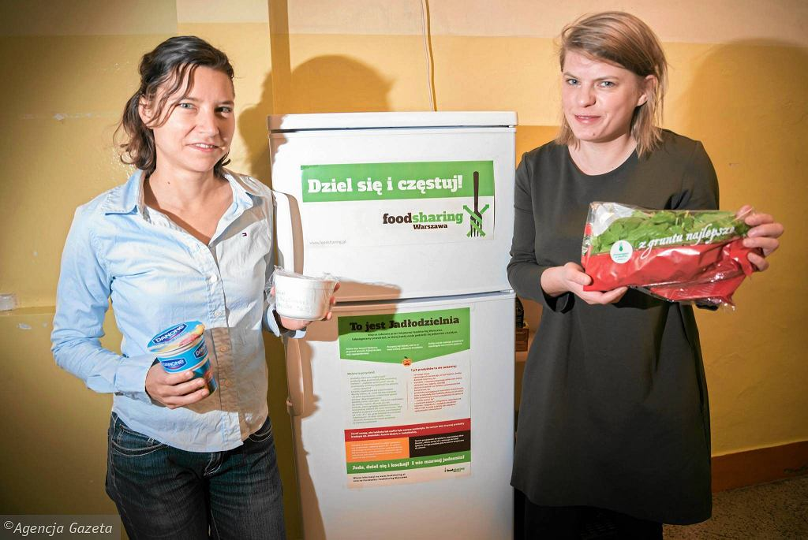
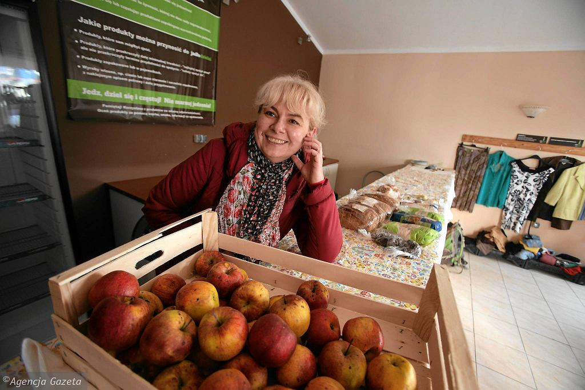

*This article was published on 13-04-2017 by cojestgrane24. [Click here to see the Polish original](http://cojestgrane24.wyborcza.pl/cjg24/1,13,21634177,147811,Jadlodzielnie-w-Polsce--Uczymy-sie-nie-wyrzucac-je.html). All pictures are taken from that article as well. No copyright infringement intended!*

If you are left with eggs with mayonnaise, salad or cake after Christmas, do not throw it away! Bring products that you can not eat to the Food-Share Points. Such points are in seven cities in Poland.

A Food-Share Point (Jadłodzielnia in Polish) is a refrigerator and/or a cabinet, standing in public places. Everyone can leave food or take it from here. There are no restrictions, besides, not to put spoiled food, raw meat, alcohol and products containing raw eggs, i.e. homemade mayonnaise.

 *21-03-2017 Szczecin. Volunteer Ania in Jadłodzielnia at ul. Kordeckiego. Picture by Cezary Aszkielowicz / Agencja Gazeta*

In Krakow, such a point is located in the Jordan Caffe café, in Szczecin - at the Turzyn Market Square, in Wrocław at the Student House, in Bydgoszcz at the University of Economy, in Grudziądz and Toruń at the fair. In Warsaw, where the first Food-Share Point in Poland was established at the Faculty of Psychology at the University of Warsaw, there are already six of them.

Each of them can be found on [Facebook](https://www.facebook.com/FoodsharingPolska/). The pictures show that the fridges are filled with all possible delicacies from bread and cheese over vegetables to preserves and jars. There are donuts, juices and ready-made sandwiches.

The first Food-Share Point was founded by Karolina Hansen and Agnieszka Bielska. They got to know each other in the organization of Food Banks, where surplus food from businesses is distributed to the needy.

 *Karolina Hansen and Agnieszka Bielska in front of the very first Food-Share Point in Warsaw. Picture by Franciszek Mazur*

'A lot of food is wasted in the world. Dates of shelf life are estimated so that the products are thrown away, despite the fact that they are still fit for consumption' - says Karolina Hansen. 'We wanted to show people that wasting food is not a problem that only affects stores and institutions, but also our homes.'

On the Internet, they found information about the German organization [Foodsharing](https://foodsharing.de), setting up points where everyone can share food. They went to Germany for a meeting and asked a lot of questions: where to start, how to care for the Food-Share Point. The first fridge, which someone gave them for free, was set up in May 2017 on the ground floor of the Faculty of Psychology. That's where Karolina Hansen works. She conducts classes in social psychology, studies prejudices and stereotypes.

> The best place for the Food-Share Point is one that is accessible for people and open as long as possible. Of course, you can organize such a fridge at work, at school, in a housing estate or in a block of flats.

The students at the Faculty of Psychology make use of the independent studies, but there are also regular outsiders. 'What you leave will disappear very quickly' says Karolina Hansen. 'I check the fridge every day, clean it and make sure it runs smoothly.'

> The biggest activity at the Food-Share Points can be witnessed during holidays - there are surpluses from private tables, but also from catering from corporate events.

'When we want to give food, it is worth checking if there is a fridge or just a cupboard in the Food-Share Point. Egg with mayonnaise is better to put in the fridge; bread, fruit or vegetables can be left in the cabinet' instructs Karolina Hansen. 'Although, of course, it's best to plan holidays so that we do not have anything left. There are plenty of economic and ecological arguments for which we should not waste food. First, we invest energy, time, money, land, to produce, transport, pack, send to stores, buy and then discard. It does not make sense!'

 *Jadłodzielnia with Mrs. Beata in Szczecin at ul. Kordeckiego. Picture by Cezary Aszkielowicz / Agencja Gazeta*

The idea of Foodsharing is growing. 15 people are involved in taking care of the Food-Share Points of Warsaw. Recently at the congress in Toruń there were people from 16 cities in Poland who would like to set up such points.

In Poland, almost 10 million tons of food are wasted annually, 2 million of which in households - according to data collected in the report "Do not waste food 2016" developed by the Federation of Polish Food Banks. Every Pole counts about 52 kg of food per year. This gives us the fifth place in the amount of food wasted in the entire European Union - behind Great Britain, Germany, France and the Netherlands. The products most often wasted are: bread, meats, vegetables and fruits.

All addresses of Food-Share Points in Poland can be found on [this interactive map](https://www.google.com/maps/d/viewer?mid=1vpCSdHuflmBIw4WWV3VFCQ4L2sU&ll=51.81707170821971%2C17.788496699999996&z=6), which gets updated regularly.