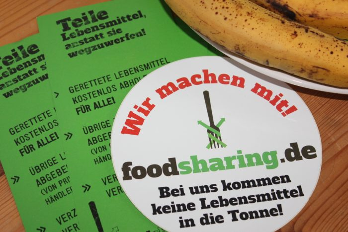
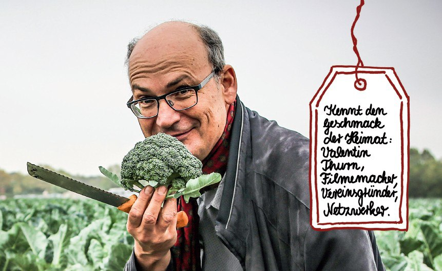
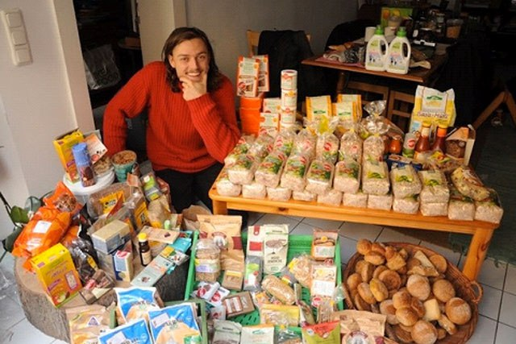

_This article was first published in Russian on [foodsharing.ru](https://foodsharing.ru/blog/fudshering-v-germanii/) in June 2017. We repost it here in translated versions with friendly permission from the original author._

Friends, we want to tell you about the history of the fight against food waste in different countries of the world. We will begin, of course, with Germany, because it was there where our parent project was born.

The majority of Russian-speaking Internet users learned about German foodsharing from the living magazine of Jana Frank - an illustrator and writer living in Berlin and leading a blog in Russian, a member of German foodsharing.

Foodsavers are given food surplus which can not be taken by food banks. Most of the unsold products are taken by food banks and redistributed to needy and socially disadvantaged layers of society. One of the largest food banks in Germany is Die Tafeln. The food banks have rather strict restrictions on products: they can only take large quantities of goods, they can not take expired goods, and so on. Sometimes there are overlays and they just do not have time to arrive at the right time and ensure that the products get picked up. Foodsharing is smaller, but more flexible, and thus able to pick up surplus products, whether it's about 100 kg of vegetables or about 10 kg of bread rolls.

## How did the German foodsharing start?

One of the founders of the movement in Germany is Valentin Turn, a German researcher, journalist and filmmaker who shoots documentaries on environmental issues.

When preparing the film "Taste The Waste", which received a lot of environmental awards, Valentin Turn held a lot of interviews with various specialists - owners of poultry farms, scientists, farmers and food industry workers. One of the main conclusions to which the researcher came: Despite modern transport, mobile refrigerators, despite food banks and other programs, mankind throws away tons of edible food, both in industry and in households, on a daily basis.

We suggest you familiarize yourself with the short film "Waste" by Valentin Thurn. In it, in just 6 minutes, it is told what consequences for the whole planet entail the waste of food:

[plugin:youtube](https://www.youtube.com/watch?v=VaouOWx3Bmo)

In 2012, Thurn with like-minded people launched the first version of the site, where people could post "food baskets" - analogous of the announcements in the groups "I'll give food for free" (“Отдам еду даром”) in Russian social networks.

The second co-founder of German foodsharing - Raphael Fellmer - is widely known for his experiment "5 years without money." During this time he lived off the excess of society: He dumpster dived in garbage dumps or got stuff from random people who wanted to get rid of unnecessary things. With his extreme experiment, he showed that society throws out so many resources that this amount is quite enough for a comfortable life with all the necessary products: goods, clothes, food.

He repeatedly found whole lots of quite suitable products in the dumpsters of supermarkets, collected them and carried them to the people. This made the activist decide to try and form official cooperations with the shops, so that they would give out the products directly, without throwing them into the trash first. After all, when food is found in a garbage can, hygienic storage conditions are violated, the product can be affected by rodents and insects. So Raphael undertook to come to the most convenient time for shops, take the goods immediately after the write-off, and then carry them on his bike with a cart and give them out to people. The first partners have appeared. Of course, for each organization it was necessary to collect a team of permanent volunteers, since one person is not able to cope not only with a large volume, but also with the task to arrive at the right time every day and then distribute the products received. One of the first large companies to join was the organic supermarket chain [Bio Company](https://www.biocompany.de/), which openly announced its participation in the new environmental initiative.

Subsequently, Fellmer and Thurn joined their projects on the same platform, and the website [foodsharing.de](https://foodsharing.de) was created in the form in which it exists now. According to the website, during the existence of the project, foodsavers collected and distributed more than 7 million kilograms of products that would otherwise have added to the garbage. The platform is also used by foodsavers in Austria and Switzerland.

The founders put the main emphasis on the ecological harm of food waste for the whole planet, because the production of each item has used up resources - water, soil, effort and time.

Currently, activists and the team are continuing to work on foodsharing in Germany, as well as on new projects to combat food waste around the world.
