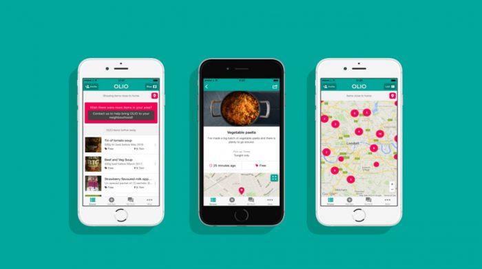

*This article was first published in Russian on [foodsharing.ru](https://foodsharing.ru/blog/fudshering-v-velikobritanii/) in November 2017. We repost it here in translated versions with friendly permission from the original author.*

Today we continue the story about the fight against food waste in various countries of the world and talk about the UK.

Great Britain, the country with the highest level of economic development, of course also faced the issue of food waste. Unlike many other countries it already has a pretty long history of fighting this problem, and it is important to mention that the state takes an active part in this endeavor. Let's talk about how the situation develops in our time.

In 2000 the organization WRAP was created. Its name stands for [Waste & Resources Action Program](http://www.wrap.org.uk/), the main goal is to help enterprises, communities and individuals move to the so-called circular economy instead of the usual linear models of production and consumption. The organization conducts educational work, which over the past few years has produced significant results. From a statement by Liz Goodman, CEO of WRAP: "In the UK, we demonstrated how reducing food waste by involving consumers and signing agreements with retail chains and brands can ease pressure on the environment and promote economic growth."

In addition to state programs, private initiatives also play an important role. One of the most famous is [The Real Junk Food Project](http://therealjunkfoodproject.org/). This project consists of a network of shops and cafés, where excess food is offered to customers on a "pay as you feel" basis. Anyone can take as many products for free as they need, and those who want to support the project can give donations that help pay rent and store services.

The project already has more than 100 shops and cafes, also in other countries - in France, Germany and even Australia. Their main goal is to allow people to eat good products that their producers are ready to throw out for some reason or another. The amusing slogan "feed bellies not bins" encourages people to feed humans, not garbage cans.

**Olio** is an application for non-commercial peer-to-peer exchange of food. The application is available anywhere in the world. It has a map and the convenient option to sort items by distance to the user or freshness. You can even set up notifications, and if someone will give food next to you, you will receive a signal. In Russia, the application is not too common yet - probably because of the English interface. However, all functions are made convenient and intuitive even for those who only know the English language very superficially.

The team maintains a website containing materials on the topic food waste. They also have a catchy slogan, with which they invite for participation: "bin labels, not food!"

Another serious contribution to the fight against food waste and the popularization of the idea of careful handling of food is made by Tristram Stuart. He doesn't need a verbose introduction, just look at his vivid performance on TED (subtitles are available in many languages):

[plugin:youtube](http://www.youtube.com/watch?v=cWC_zDdF74s)

Even the business sphere has been affected by these trends. [Winnowsolutions](http://www.winnowsolutions.com/) offers its customers a high-tech food waste analysis and accounting system that allows to analyze and reduce waste, the company also maintains a blog on the site. Reducing costs is profitable and promising!

We see that in order to work on reducing the amount of food waste, unanimity of the society is necessary: both state organizations and private enterprises, as well as ordinary people are needed. The issue of food waste concerns all of us, and everyone can help to make a difference.