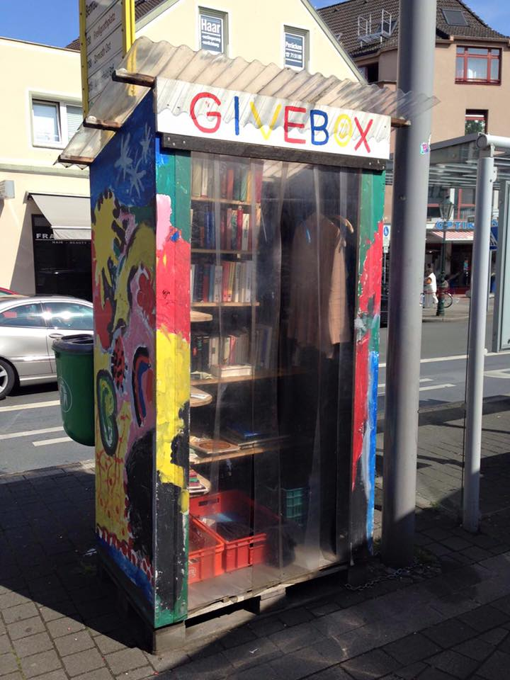
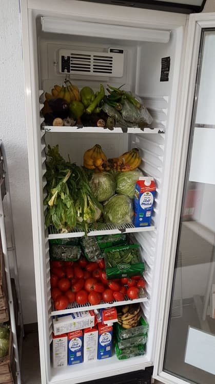

*This is part 1/3.*

It was February 2016. I was sorting out some excess stuff: shampoo that I used once but never really liked; my bicycle seat that is in good condition but could never be resold; a book that made me fall asleep once I’d start reading it. I packed all of them in a tote bag and left my home in Düsseldorf, a German city.

The “Give Box” was just a hundred meters away from my apartment. It was a shelf-like, rectangular prism located right on the edge of the market place. I left my stuff there and took away a dress someone else donated. It’s free to leave and take any objects from the box.

 *The inspiring Give Box in Düsseldorf*

I had no idea this small incident would become the starting point of some unforgettable experiences in the coming months.

After I went home from the 10-minute excursion, I started to look for ideas to write about as a journalist. That's when I came across a Greenpeace report released a few years ago about Hong Kong's supermarket food waste. It was unbearable to see all that fresh food dumped.

Hong Kong is a renowned food paradise, and maybe that's the reason why our people don't really seem to treasure food. We waste as much as 3648 tons of food per day. Our supermarkets ditch around 30 tons of edible foods daily. These shops’ selling strategies often encourage us to make unnecessary bulk purchases and buy groceries that are meant to be forgotten. (I found a pancake mix that expired in 1999 a few years ago) There are food banks, which provide food for the lower-income class. But they seldom accept expired food or in most cases, you have to plan your visit -- which I found demotivating.

It's a sin to throw away food when 795 million people in the world are suffering from hunger. To consume less is probably the best way to reduce food waste, but it's not that easy to completely change your daily routines all of a sudden. All of us have experienced that before.

 *A Fairteiler in Düsseldorf*

An inspiration suddenly struck me: What if I set up a give box for food, a “Fairteiler” like those organized by [foodsharing.de](https://foodsharing.de), in Hong Kong? What will I see, will the plan work at all? Journalists always find stories, but why couldn’t we create them? For once, the passive me, who never really actively does something about environmental problems and usually thinks that it's someone else’s job, now wants to start a social experiment on her own. I’m giving myself three months for a trial. It doesn’t matter if it fails. It doesn’t matter if I never belonged to the active ones and have no connections at all. Just start, and see how it evolves.