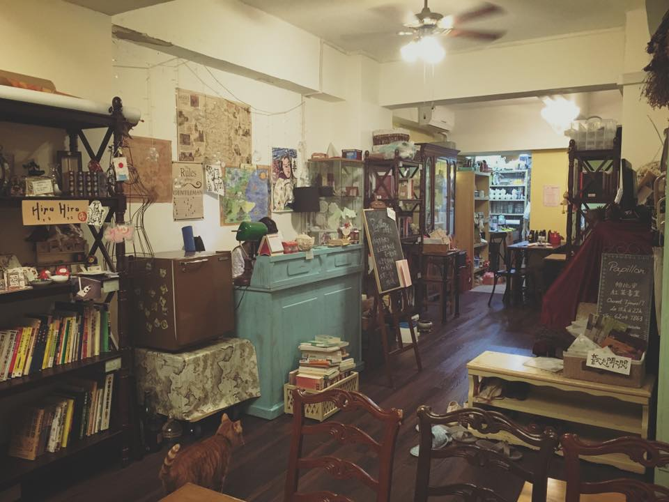
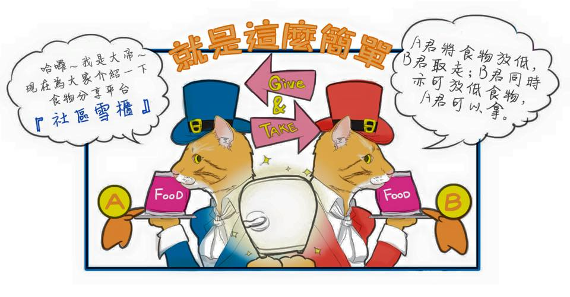
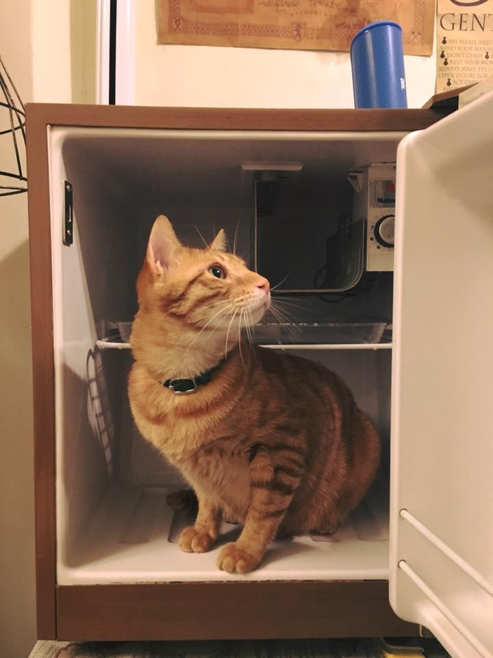

_This is part 2/3._

When I told my brother about the idea to start a food share point in Hong Kong, he was excited. I remember him saying that this is something completely new to Hong Kongers. Judging from our habit to be easily attracted by the new, the experiment might even become popular.

I was lucky; location was not a big hindrance for the project. My friend Charlie owns a tearoom which visitors often describe as “relaxing and tranquil”. It was mid-April when I called her. I asked if she would let me set up a mini fridge and shelf for food sharing. Kind as she is, she said yes quite quickly. “But our shop is in a residential building. It's not very accessible to the neighborhood here”, Charlie warned, “Are you sure this is an ideal location?”. She was right, the tearoom is quite hidden since there are no clear signs pointing towards it from the street level. Yet I just ought to try.

_The cozy tearoom with the brown mini fridge that acts as the food share point_

Shortly after I confirmed, Charlie introduced me to a group of young people who run a platform for social projects. The platform [Collaction](https://www.collaction.hk/) is similar to crowdfunding sites like Kickstarter or IndieGoGo, but resources are raised instead of funds. I set up a project page on there to protocol the initiative’s proceedings. Two weeks later, when I flew back to Hong Kong, I met up with the two co-founders, Amy and Nelson.

“We already got you a used, small fridge,” said the two startuppers at the tearoom. “Eh—What?!?!” My jaw nearly dropped to the floor, because this was not something I expected. I needed nothing else to start the project. The only extra equipment I bought was a shelf for some non-perishable goods. At this point, everything was so smooth I almost couldn't believe it. I came to know Yimini, an artist and professional illustrator through Collaction. She offered to help illustrate the concept with comics. With all this help, I never felt alone. I realized that a lot of individuals are endeavoring to change the city. There are sites and initiatives for exchanging and freeing resources, there is even one especially for food. It is just that I didn't know them, because I never actively participated and never paid attention to these issues.

_One of the explanatory graphics made by Yimin_

There was a “wall of wishes” at the tearoom, made from clusters of post-it notes in the form of a butterfly. “Food sharing Project: Success!” I wrote down my wish in Chinese and put it up on the wall.

Yet, my hopeful days did not last long. Very soon after I set up a [Facebook page](https://www.facebook.com/foodsharinghk/) for promotion, I realized that I was stuck in a vicious cycle. To promote the idea, I needed content on social media, i.e. at least some pictures of food. But photos of an empty fridge were utterly meaningless. No content means people will not be reached by the initiative. No exposure, no food; no food, no content, no exposure…you can tell the rest.

_Nothing in there but a cat..._

Another good friend also brought me down unconsciously. He was more pragmatic than idealistic. He predicted that the project will not work if the station is upstairs. “And in Hong Kong? People might just take away everything. Maybe even the fridge! Some may also resale the products,” he said, indicating that the mentality of we Hong Kongers is simply so different that it would not work as well as in Europe. I was upset, because I feared that what he was saying was not far from the truth. I knew it right at the beginning. Nonetheless, it is exactly the reason why I wanted to try. There are greedy people everywhere in the world. Germany is not an exception. If food sharing could work there and elsewhere, why not in Hong Kong?

It was mid-May; I still had two months to go. By then, no one knew about the project except a few tearoom customers. They did not participate in the project, because nothing was at the station to give them the idea to share, too. One cannot simply say “Hey, here's the station, come and share!” I started to panic, because every day was a count-down to the experiment's end. I must have looked so worried that my parents also started worrying about me. When they asked about the situation, I burst into tears and could not even talk properly.

But then my father came up with a clever, undogmatic tip that would turn everything around...
