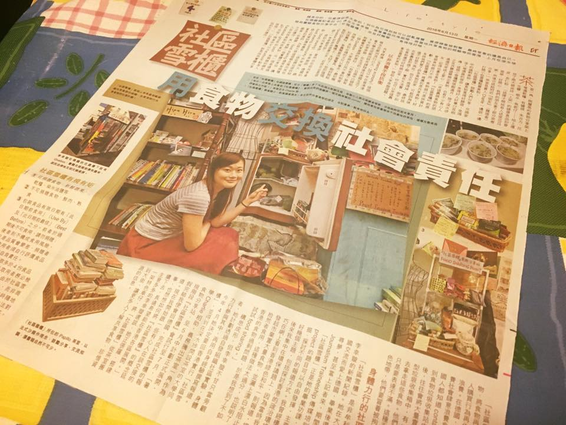
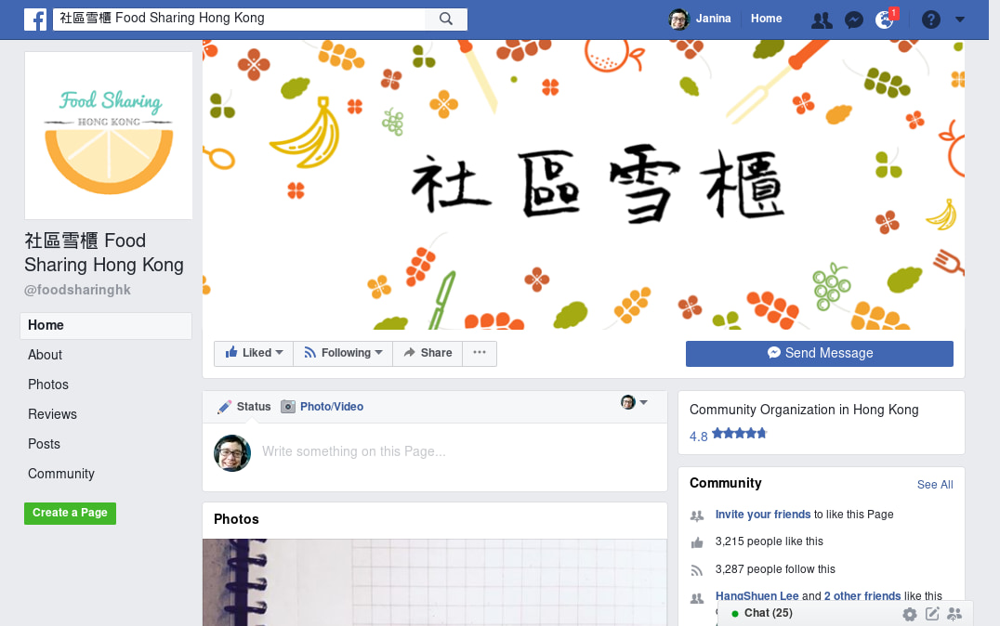
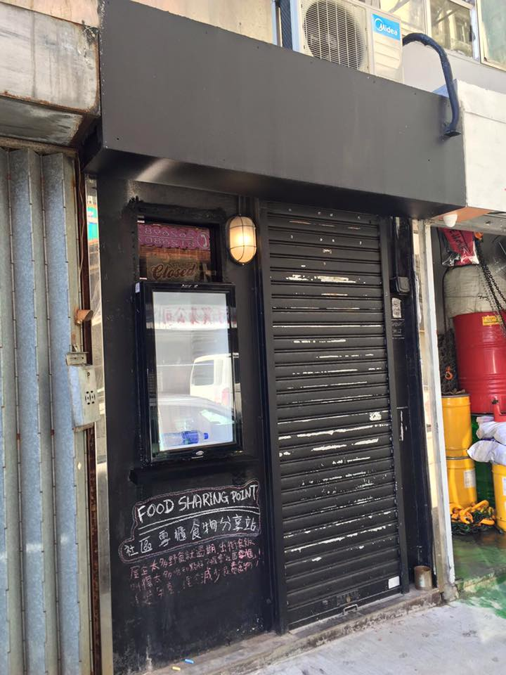
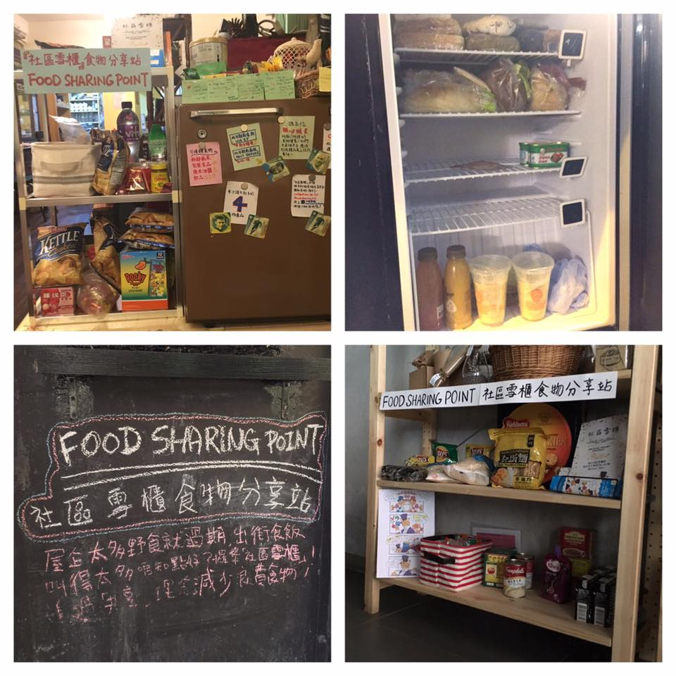

*This is part 3/3.*

„You gotta cheat a little bit. Why don't you buy something and put it there?“ A sharp, pragmatic tip from my father.

If only I had come up with this idea earlier! I bought some snacks and arranged them on the shelf, snapped some photos and put them on Facebook. Finally, I could announce that the station exists. To create more content, I contacted similar initiatives to exchange views. The first person I met was Yan, owner of the Facebook page [Empty Plate Action HK](https://www.facebook.com/EmptyPlateActionHK/), which shares information on food waste. Coincidentally, Yan was also a journalist, so we literally interviewed each other. In her opinion, projects like food sharing face difficulties because most Hong Kongers are too caught up their own business. „They only care about the people in their circle. The rest doesn't matter to them. Moreover, most of us just want to be observers.“ An observer – wasn't that exactly what I always used to be?

 *The newspaper article in The Economic Daily*

A few days later, Yan's report was out. Another journalist read it and contacted me for yet another interview. The second story was published on a renowned newspaper site and spread quickly online. People started to notice the project; they gave likes and shared the page. Notifications flooded my Facebook, which caused my mobile to beep all day long. At the peak of exposure, the page received more than 200 likes a day. This is the first time I truly experienced the power of media and its snowballing mechanism.

As the initiative got more popular, the number of physical visitors increased as well. Many of them were office workers, some were housewives. Popular food items were chocolates, candies, oatmeals, drinks and spices. Some would travel a long distance to give away their food. A tearoom customer even offered to share tea regularly. As a tea lover, she simply had too many different kinds of tea that she would never be able to finish by herself. Seeing the station regularly in use was the reward I had longed for so much over the frustrating weeks before. Now I came in touch with so many activists, social workers and active individuals who I'd never have gotten the opportunity to get to know without this project. Every single conversation with them was inspiring.

 *The foodsharing Hong Kong facebook page as of May 2, 2018*

In mid-June, I tried to expand the project. My brother suggested a vegetarian restaurant, which to a certain extent functions like a public space. Similar to Charlie, the restaurant owner, Bong, also agreed very quickly. “There are things that we should care about other than numbers (money). Not everything is about sales,” he said in an interview. “There are resources that one does not see as noteworthy, but others might actually want them. Through this platform, these resources can have their value back again.”

But of course there are also disappointing perspectives and bitter stories to my food sharing success. Although the number of visitors increased and people came to know about us, it is unclear how many people truly understood the idea of food sharing. Some participants saw themselves as “donors” and treated the station as a food bank. They bought extra food to “donate”. Many people would not come to the station to just take food, because it probably still felt too embarrassing. Some treated the station as just another trash can (this may sound rude, but it's actually accurate) and threw in whatever food – supplements, opened bottles, mysterious food without any labeling – that they did not want any more. Very often I had to throw away food. This made me feel guilty even though I didn't do anything wrong. If only people would understand that sharing means everybody has equal chances to give and take away resources; if only they would savvy that the ultimate aim is to minimize unnecessary domestic food waste; if only they would understand that sharing means only giving away something you yourself would still want to use or eat… then situations like the above would not have happened.

While I am still very convinced of the idea of a sharing platform, I also see the risk that it might accidentally even *encourage* consumption and waste: Individuals and companies will know there is always a place for them to dump food. They will not have to give any thought about buying or producing something. „Sometimes companies will send us cartons full of products, just because they misspelled a word on the package,“ said Mr. Fung, an active volunteer at a community center. „We should not encourage these wasteful practices, but we can't simply let them throw away the food. Without any doubt, the ultimate solution to food waste is to eliminate unnecessary consumption, not a sharing platform."

Shortly before I returned to Germany, many people asked about the future of this social experiment. I decided to continue to organize it from overseas, since the concept of the food sharing stations are that one should be able to operate them with minimum human and financial resources. My brother agreed to help whenever a physical presentation should become necessary.

 *Always accessible*

The third station opened a while after my return. The boss of an alternative shop contacted me. He replaced the glass window of the shop with a fridge, making the station accessible 24/7. Because of its accessibility, it was always in use. Just weeks ago, another incident happened which I had feared all the time. It has left me wondering whether this model is really suitable for my city.

Around 70 boxes of snacks were delivered to the station. It was such a huge amount, that it could only be left in front of the shop. Surprisingly, all boxes were gone by the next day. Witnesses said that a group of old ladies and South-east Asian looking men had taken them all away. This was extremely egoistic, because the chance to also benefit from these resources was taken away for all other people. Again, it makes me wonder if people truly understand the idea of food sharing. It is possible to run such an idealistic project in places like Hong Kong, but it takes a longer time to be understood by its citizens. Incidents like the above are in a way, an education to all of us.

All of these experiences, all of these reflections would not have been possible if I had not taken that little step. If all of us just started doing something, without thinking or worrying too much, how would this world look like?

 *Functional food share points in active use!*