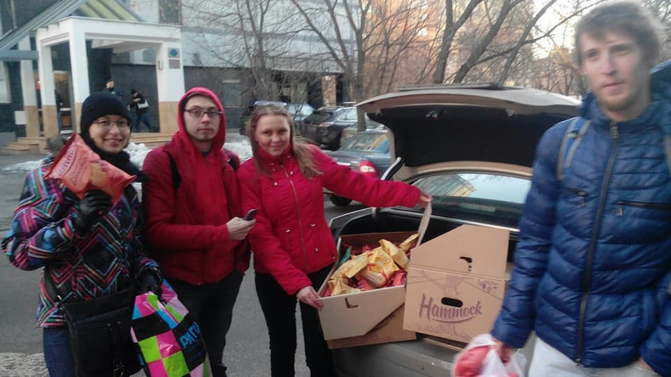

_Part 1/5_

Hello everybody, I am Anna Uspenskaya, founder of the [Foodsharing Moscow project](https://foodsharing.ru ). I’m going to tell you how Russians can get involved in saving and sharing food.

## The Idea and First Steps
I learned about German Foodsharing in the winter of 2015 from the blog of Jana Frank, an illustrator and writer of Soviet Union origin living in Berlin and writing her blog in Russian. She often told her followers about her experiences as a foodsaver in Berlin.

I knew almost nothing about ecology and environmental concerns at that time. I had barely heard of the harmfulness of food waste. But it sounded really fantastic for me that people could get for free such amounts of high quality food and that all of this food might have been thrown away otherwise. In my family we had never any food leftovers thrown away. I have never been starving, but when I was a student in the late 2000s it was sometimes difficult for me to earn a living to survive, and not end up being expelled from university for truancy. I had no extra money with which to go to the university cafeteria every day so I cooked my lunch at home and brought it to university with me. On my vacation trips I tried not to spend money if at all possible.

_Collecting leftovers in the canteen of the Moscow State University Summer Camp, 2009. I was against food waste from the age of 19._

By 2015 I had graduated, had a fulltime job and was looking for volunteering opportunities to help other people. I got involved in some volunteer trips to an orphanage and donated, from time to time, to some charitable foundations. I knew that lots of people were living under conditions of extreme poverty. At the same time, however, Moscow is quite a rich city. There are a lot of cafes, bakeries and restaurants here.

_Trendy cafes in Moscow_

So I decided to undertake some research. I visited cafes and small bakeries and asked the employers if they ever had any leftovers at the end of the working day. Of course they had. But when I asked if they would be able to give them to myself or someone else who would be able to come by at closing time to pick it up, the employers looked troubled. The most common answer was: "I'll pass on your request to the boss but I don't promise anything." I realized that my request may have sounded really strange to them. I had to work out a plan and come back to them with a better proposal.

I created foodsharing groups and pages in the most popular social networks; posted all of the relevant information that I could find in Russian and English about Foodsharing projects in Germany; and wrote about my desire to set up something similar. I also got in touch with foodsaving activists from Moscow and Saint-Petersburg. One day a Russian girl, living in Germany and coming to Moscow from time to time, wrote to me. She was doing foodsharing in Germany and she helped us a lot. She coordinated a group of volunteers who had a working knowledge of German and they translated the most essential articles from the [Foodsharing Wiki](https://wiki.foodsharing.de/Hauptseite). When the translation was completed and I was able to read it it became much clearer to me how it all worked. But we definitely had to rewrite the rules in order to make it clearer for Russians, and to come up with an alternative tool for coordinating as soon as possible as we didn’t have the foodsharing.de platform. First of all we created an open Google Map and invited all potential foodsavers to check in there and let us know where they lived. Working out where everyone interested lived was important because Moscow is a very big city and we wanted as many people as possible to be able to work together.

Shortly afterwards we undertook our very first foodsaving expedition. A snack manufacturer had some unsold products and didn’t want to throw them away into the garbage. Whilst looking for an alternative option he found our group through social media and wrote to us.

_One of our first pick-ups_

As we began to gain experience of working and cooperating together we made it a priority to clarify and formalize the rules for foodsavers.
In March 2016 we gave a first public lecture about foodsharing in Moscow. We did a screening of [Valentin Thurn’s short movie “Waste”](https://www.youtube.com/watch?v=VaouOWx3Bmo) and provided an explanation about Foodsharing in Germany and how it could serve as a model and inspiration for us as we continued to develop our project and our plans.

We created and printed flyers and began to introduce ourselves to cafes and small bakeries in the center of the city and discuss with them the possibility of collecting unsold food that would otherwise go to waste. During our first months we attracted more partners. As we started to gain experience we also realized the need to redesign some parts of our project.

We created a management system using several popular free software tools:
- Vkontakte chats for teams’ communication (Vkontakte is a Russian social network; the group chats there are very fast and easy to use)
- Google Forms for a quiz (people who wanted to join are required to pass a quiz which evaluates if they have read the rules and understood what foodsharing is all about);
- Google Sheets for schedules and weight reports;
- Google Fusion Tables for foodsavers’ database management with map representation;

_Example of our schedule in Google Sheets_

Foodsharing began to work well, and we were really delighted about the way that things had developed. The community in Saint-Petersburg was growing at roughly the same rate as our one in Moscow, and they were also successful in getting some of the bakeries, stores and cafes to cooperate.
