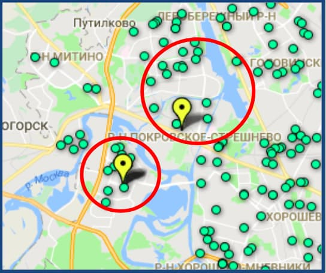
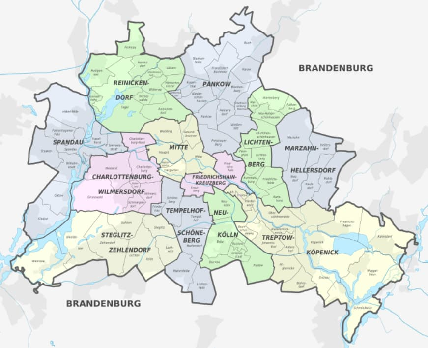
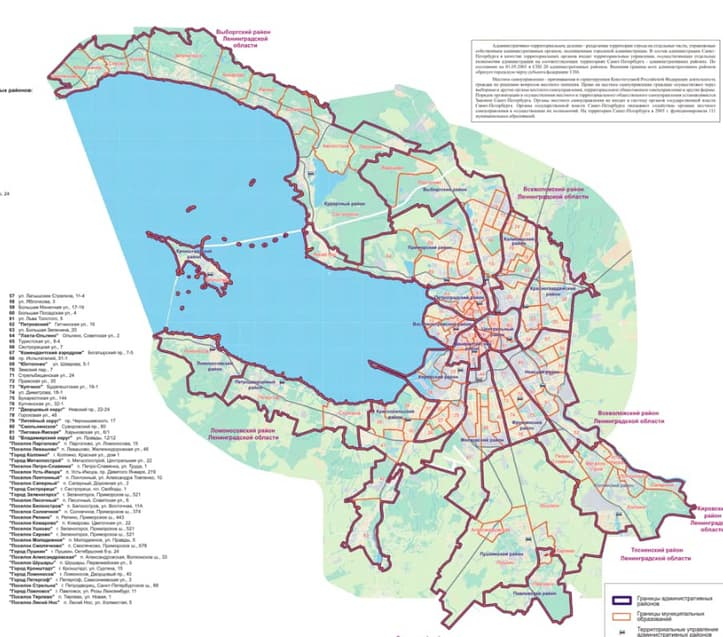
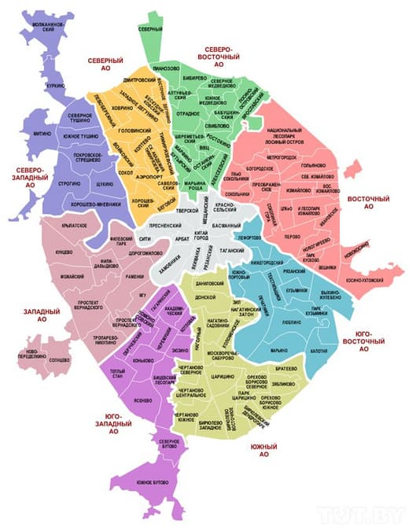

_Part 2/5_

# Foodsharing taking off

The more stores we had working in cooperation, the more difficult it was for us to carry out the management, schedule supervision and leftovers’ weight control. So we decided to work on automating certain processes.

We developed tools for managing the data:
- А tool which summarizes and monitors weight statistics - for each partner separately, monthly for all partners, and the overall amount
- А tool which measures logistics - travel time between every new store and every foodsaver, worked out automatically from a database. We are now able to run database queries like “select top-N nearest foodsavers for a new store with a given address”. This makes it far easier to create new teams of volunteers living nearby
- Other filters within the database to view selected records. For example we can view all foodsavers who have a car when we need to pick up large amounts of food

Now, when a new partner appears, the required number of foodsavers living nearby get notifications via e-mail and can be part of a team picking it up if the conditions are convenient for them to do so.

It may look to some people as we are over-complicating things through our use of sophisticated software. Sometimes people ask us why can’t just post information about new cooperating stores online so that people would be able to quickly find a team to join. The answer to this question is simple - there have always been many more people interested in volunteering than the availability of free positions in foodsaving teams. Most of these people were willing to travel to foodsharing points anywhere across the city even if it took them two hours to get there! So if we were to post something like “foodsavers wanted for a team to collect food from a new cafe” within a few minutes there would be more than enough volunteers and we would have to have a selection process. We don’t want foodsharing to become a competition of “write a comment as fast as you can and get some food for free”. We want it to be a truly effective and environment-friendly project and don’t want people to transport food across the city for hours and waste both time and resources.

_The green points represent foodsavers and the yellow points cooperating stores_

I know that German foodsavers have separate groups for each district. Our friends from Saint-Petersburg do the same. We were actively considering this way and made some experiments in trying it out but found that it doesn’t work for Moscow. The best way to organize a foodsaving community depends upon multiple factors including city size, planning, and administrative-territorial division.

_Berlin: 12 districts_

_Saint-Petersburg:18 districts_

Berlin and Saint-Petersburg are much more alike in layout than Berlin and Moscow.
In Moscow, the districts are too large, and the subdistricts are too small, to build efficient and effective foodsaving teams using these boundary divisions.

_Moscow with its 9 districts and 125 subdistricts_

The tool that we use is based on Google Maps Directions and allows us to be flexible. It allows us to invite only as many foodsavers as we need and thereby allows us to avoid creating disappointment. It also allows us to ensure that the foodsavers’ route to the pick-up point is as short as possible.  

We now have about 1000 registered foodsavers, although fewer than half of them are actively involved in fetching food from our partners. Sometimes those who have never received any invitations to be part of a team become frustrated. In such circumstances we have to explain to them that some distant subdistricts don’t have yet any partners in cooperation, and propose other options that they could explore such as talking to cafes and stores nearby or other activities that they could become engaged in depending upon the volunteer’s skills. If a registered volunteer helps us we always try to give him or her options when free positions appear.

People from [yunity](https://yunity.org) advice to never use the promise of "free food" as an incentive and, instead, to promote the idea that foodsaving isn't about free food but rather about fighting a wasteful-system of food mismanagement
([“How to build a foodsaving community”](https://yunity.atlassian.net/wiki/spaces/FSINT/pages/91665893/How+to+build+a+foodsaving+community#Howtobuildafoodsavingcommunity-RaisingAwareness)).
I don’t know about how things are in other countries but in our country it’s impossible, now, to genuinely get people to see things in these terms. Obtaining free food is a more powerful motivator than fighting food mismanagement for most people. However, I don’t think we have a critical problem here. There are both advantages and risks to having this high demand for foodsaving opportunities. There certainly are some benefits as we never have problems with getting enough volunteers for food pickups.  
