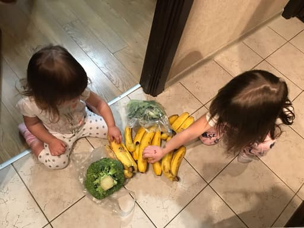
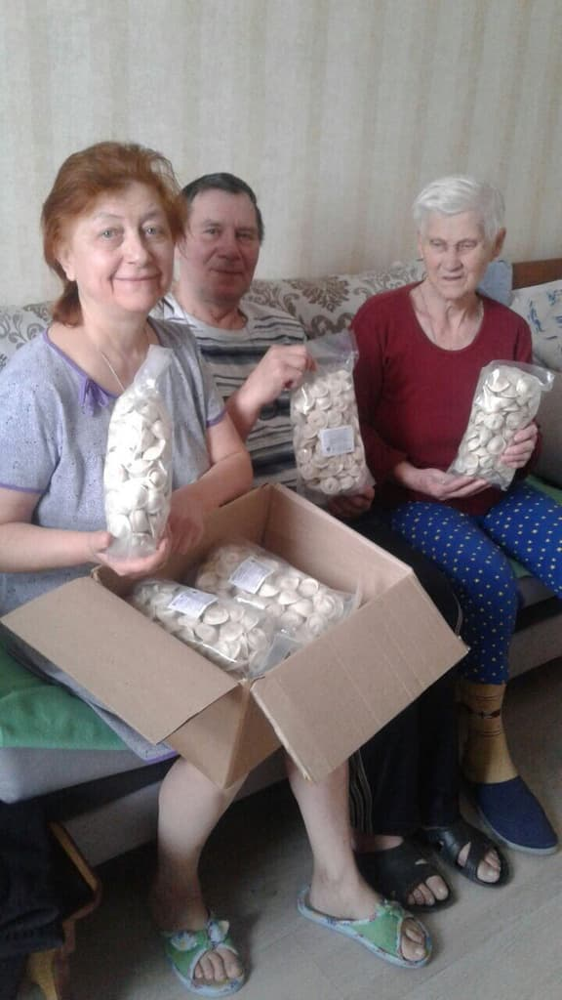

_Part 3/5_

# Foodsharing and charity

As has already been pointed out here, the most common motivating factor for being a foodsaver in our case (Russia) is the access that it provides to free food. But the most motivated and conscientious foodsavers are not those who are in need themselves. The best foodsavers are people who like helping other people in need, regardless of their own financial situation. They may be students, working adults who want to help their elderly neighbors, mothers who already have many children but who want to help large poor families, or retirees who want to help each other.

Some foodsavers who were particularly enthusiastic asked us for advice on how to best distribute all of the saved food. They asked, in particular, for contact details of people in need. What is more some of our partners also expressed their wish to give their surplus food to charity. Some of them were extremely insistent upon this point. Comments made by them included:

>I would like to give surplus food to people in need and not to all these hippies who are too lazy to work.

>No offense, but when a guy about my age without any disabilities says it’s cool not to spend money on food I should better throw this food away than give it to him.

>— _Marketing director of a young food delivery service_

Environmentalism and concerns about sustainability aren’t, per se, popular. Of course we tried our best to raise awareness, but we have had to accept the reality of the way things really are. Giving most of the food to charity allows us to have more willing partners and to save much more food.

So we decided to add a new rule for foodsavers to share food with people in need. Of course it took time to find contact details of people in need for foodsavers who had no such contacts of their own. We established cooperation with some charitable foundations and they were happy to receive free food for people they are helping.

_Large families and old people get food from foodsavers: fruits, vegetables and frozen pelmeni (kind of ravioli with meat)_

We still don’t collect food being offered as a donation as if a business wants to donate some goods to a charity, they don’t need foodsharing. But employees and volunteers from charitable foundations don’t have the time or availability to come every day to the food pick-up locations to pick up leftovers. They need some kind of “facilitator” like foodsharing. Foodsavers are still allowed to retain some food for themselves but charity also gets its part, and there is no wastage.

Making this change to our way of operating was a really important milestone for us. By becoming a charitable project we began to attract much more attention and, as a consequence, got more organizations interested in cooperating with us.  
