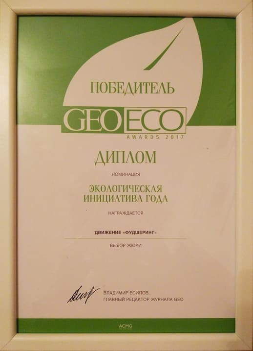
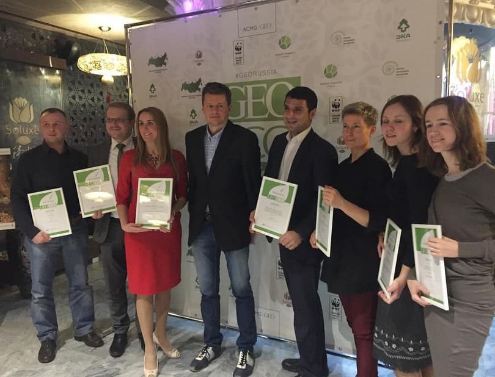
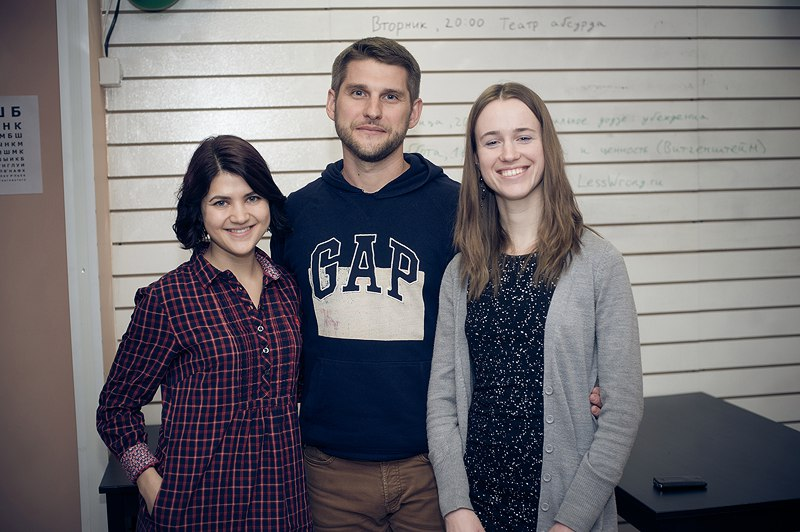

*Part 4/5*

# Environmentalism and Sustainability

We don’t allow ourselves to forget that foodsharing is an undertaking motivated by environmental concerns. Festivals and conferences on ecology and environmental protection often invite us to present lectures. We speak about the situation with regards to food waste in Russia; foodsharing in Germany which was a model and inspiration for us; and about our plans for future. We have participated in some activities organised in cooperation with Greenpeace Russia. In December 2017 we received the GEO Eco Awards in the category "Best Environmental Initiative of the Year”.

 *Myself (first from right) and other recipients at the GEO Eco Awards ceremony*

### Team

When we started in 2015 there were only two of us - myself and Andrew Kuhnin. Anna Korneva, a german foodsaver, joined us January 2016 and helped us a lot by informing us more about foodsharing in Germany, and translating information about foodsaving in Germany into Russian for us.

 *Anna Korneva, Andrew Kuhnin, Anna Uspenskaya - March 2016*

Two months later Anna Korneva went back to Berlin. In the summer of 2016 Irina Mezhova joined. Irina was managing our volunteer database (validating and adding new foodsavers) and coordinating with some of the stores. Mikhail Shcheglov, a software developer, has been involved in developing our web-site and tools for coordinating since December 2016. From January 2017 onwards Irina and Andrew both, regrettably, had no more free time for being involved in foodsharing. Konstantin Ponomarev, one of our coordinators, took over the responsibility of validating and adding new foodsavers to the database and become a co-organizer. As for me, I am involved in negotiations with new partners, mailings for building new teams, collecting information on people in need and ensuring that all of the other processes of foodsaving run well, as well as taking charge of Public Relations and Education like presenting information about foodsharing at conferences and posting news updates on social networks.

All of us have jobs in addition to our work for foodsharing. During the first two years from summer 2015 until autumn 2017 I had a full-time office job. Scheduling negotiations and other events was very difficult because I was only free in the evenings or on weekends. Since autumn 2017 I have been able to work remotely. My working hours are now flexible and I am able to balance my paid-work responsibilities with my responsibilities for foodsaving much better.

### Our Legal Status

Foodsharing Moscow is a completely non-profit project and does not collect donations. The project has no legal status. I would like Foodsharing Moscow to be a registered association but this kind of activity is not authorized in our country. Even if we register, we will not be able to sign contracts with our partners. If a non-profit has not any contracts or official reports it gets closed. So we are collecting lawyers’ opinions and looking for the best way to move forwards. Our goal is to involve as many organizations as possible in cooperation with foodsaving. We want large corporations to stop throwing food away and, instead, to give it to the needy through charity, foodbanks or foodsharing. In Russia there are legislative restrictions that obstruct the donation of unsold products. We need legislative amendments in order to stimulate food donation and laws against food waste. We are working on this as we can.