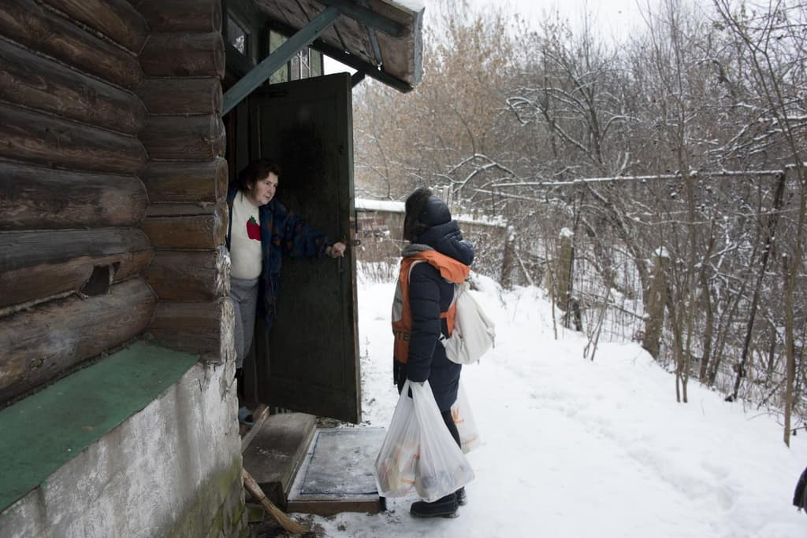
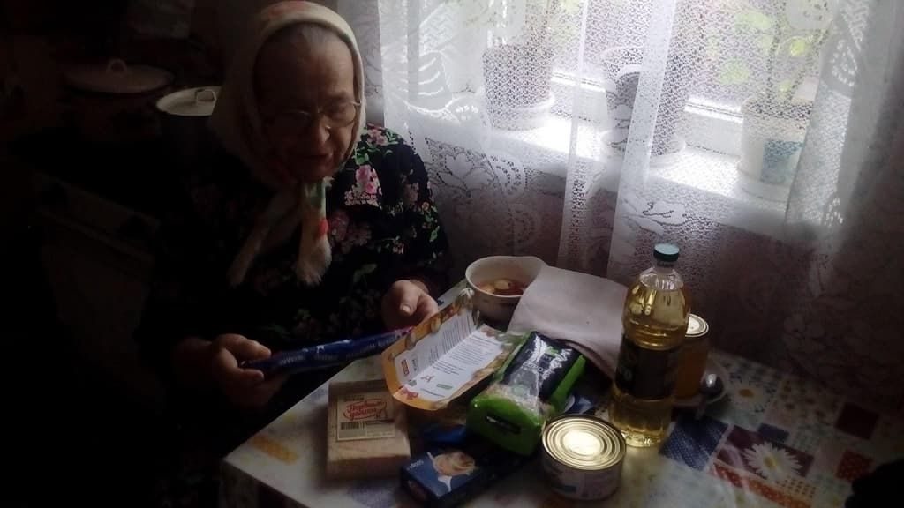

*Part 5/5*

# Other Organisations, Initiatives and Events Involved in Saving and Sharing Food in Russia

### FAO UN

We met the head of Food and Agriculture Organization of the United Nations, Eugenia Serova, in her office in Moscow. We discussed problems of food loss and hunger and agreed to cooperate on raising awareness about food waste. We plan to participate in conferences organized by the FAO UN in Russia.

### [Open School of Sustainable Development](http://www.openshkola.org/open-school-of-sustainable-development/)

This is an initiative to promote the ideas of sustainable development by providing information to the Russian-speaking population through online education. They do monthly free webinars dedicated to the [17 SDGs](https://www.un.org/sustainabledevelopment/sustainable-development-goals/) - a set of goals adopted by UN to end poverty, protect the planet and ensure prosperity for all. I presented a webinar dedicated to goal 2 “Zero hunger” and 12 “Responsible consumption and production”.

### [Food Bank Rus](http://foodbankrus.ru/en)

The first and only foodbank in Russia was established in 2012 and is a member of [Global Foodbanking Network](https://www.foodbanking.org/what-we-do/our-global-reach/).

 *The elderly living in countryside poverty get help from Food Bank Rus*

We are in touch with them and have some cooperation.

### Foodsharing in social networks (“I Give Away Food for Free”)

There are some groups and pages in social network Vkontakte named [Foodsharing: I Give Away Food for Free](https://vk.com/sharingfood) ([also this one](https://vk.com/food_sharing) and some others). Their foodsharing system works like this - if someone wants to give away some food he or she does not need, they post in this VKontakte community. Whoever is the first to post an "I'll take it" comment gets it. There are no social or distance preferences, all that matters is speed of posting a comment. Some of these communities have cooperations with stores, but they have no rules or any sort of quiz for foodsavers. The organizers post something like “A pick-up today, address, time” and whoever is the first to comment is permitted to come and save food. Some of these groups don’t allow meat, fish and seafood to be saved or shared.

### Fair-Share Points (“Public Fridge”)

In 2016 the organizers of “I Give Away Food for Free” community in Saint-Petersburg sought to set up a Public Fridge on the front porch of a charity shop as an offline representation of the foodsharing idea. The day after opening it was closed by Rospotrebnadzor (The Federal Service for Supervision of Consumer Rights Protection and Human Well-Being). The organizers had to pay a fine. Fair-Share Points give a great base for sharing food but the European model did not catch on here.

# Promotion, Motivation and Plans for the Future

We don’t do our own public activities. I wish we had some cool events like Disco Soup, but I have no time to organize it. Besides, we don’t need to draw people’s attention to the saved food and to prove that it's edible. Russian people are rather conscious about food waste. Food loss in Russian households is only about 13% according to Rosstat (Russian Federal State Statistics Service).

We need global changes like the new [law of 2015 in France](https://ec.europa.eu/food/sites/food/files/safety/docs/fw_eu-platform_20170331_pres-10.pdf) and [Italy](https://foodlawlatest.com/2016/11/26/the-italian-law-against-food-waste/) stimulating food donation for supermarkets, and the [Good Samaritan Food Donation Act](https://en.wikipedia.org/wiki/Bill_Emerson_Good_Samaritan_Act_of_1996) in USA. Maybe one day we will have an opportunity to propose such amendments to our laws.

We need to draw public and government attention to both the food loss in production and retail as well as the plight of retirees, the disabled, single-parents, poor families living below the poverty line, and the malnourished or starving. We also have to be careful in order to not be closed down. We are operating in a very gray area between what would be considered licit and illicit activity. We seek dialogue with the government rather than confrontation even if it means taking a small step backward (for example to exclude expired food). Only being entirely legitimate will allow us to go forward.

My first motivation was to create a project like German Foodsharing because it’s cool. I wish such a project existed in Moscow when I was a student. However, now, everyday, I receive about a dozen messages from charity foundations and common people asking for food. They are all calling for our help and so this has become the strongest motivation for me to seek out more organizations with who we can cooperate.

Last but not least comes the environmental reason and motivation for this activity. I consider myself to be a part of an ecological movement which promotes separate collection of waste types and recycling. Currently there are big problems with waste and recycling in our country. Foodsharing, in a sense, already offers a way of having a separate collection of food waste and recycling it by giving away unsold food for free.

I hope foodsharing will continue to develop in Russia. I am seeking to bring together all social institutions including business, charity, government and internet-based self-organizing communities in order to reduce waste, eliminate hunger and help us all to move towards a sustainable world.