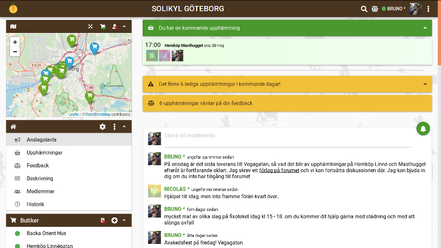
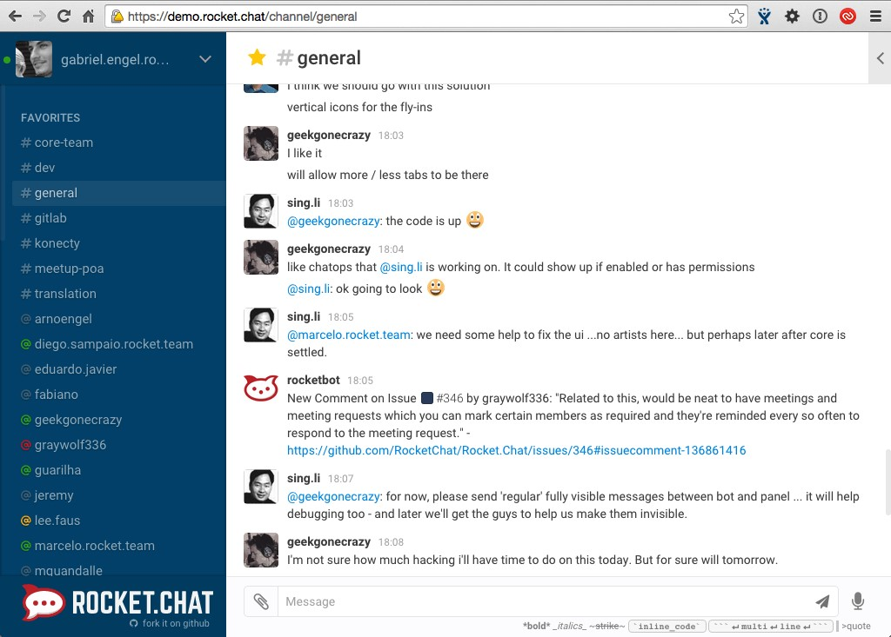
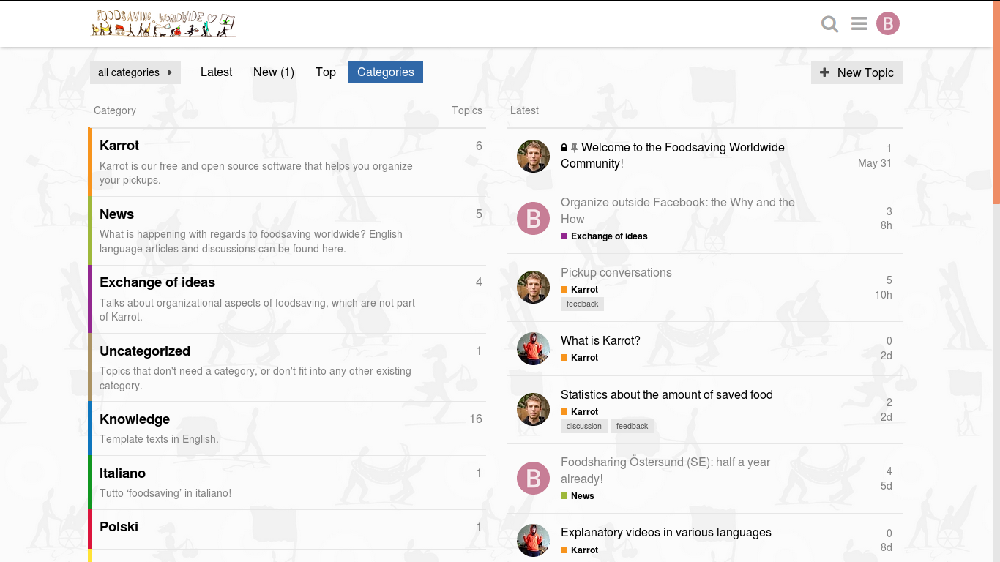

## The Why and the How

If you’re getting started with your foodsaving group or if you established one already, the most natural option is/was a Facebook group or page. Facebook is possibly the online platform where you can reach out to the greatest number of people living in your region who might care about food waste, so I won’t deny its power in regards to outreach and campaigning.

In fact, I actually take quite a pragmatist approach in my own foodsaving community by continuing to use it strategically, so we haven’t ditched it completely. But only using it for PR and campaigning is actually one reason we are success at organizing ourselves.

This text will not only be about why Facebooks sucks on many different levels, I will also present a number of alternatives and share my own experience as a community organizer who is particularly interested in the potential of free, open-source and more ethical choices of digital tools.

## Why?

There are basically two reasons why you should not rely on Facebook to organize your foodsaving community, or any kind of grassroots community/organization for that matter. One is ethical and the other is practical. I’m not gonna go on about the ethical reasons, for there are plenty of well-document material and articles out there on Facebook’s shady business. I guess you’ve heard about the latest [scandal](https://www.theguardian.com/news/2018/mar/17/cambridge-analytica-facebook-influence-us-election) on the Cambridge Analytica collecting data on millions of users and manipulating public opinion in favor of Trump or Brexit.

If you don’t mind being the product - not the user - being sold by Facebook to the highest bidders and the target of commercial advertisement and political manipulation, then being on there is not an issue. If you and other people in your community don’t care about feeding the monster’s algorithms that are rigged toward unaccountable profit-maximization of Silicon Valley’s shareholders, then you’re fine. But then perhaps you do care about organizing effectively against food waste?

Facebook is not a good choice for organizing, simply because information might easily get lost of view in the overflow of information of its newsfeed/timeline and not reach the people who matter the most, those who are really committed and willing to put their energy and time into the project. Don’t be fooled by the numbers of likes or of people joining your Facebook group. The support feels nice, but the people who matter are the 1 out of 50 who will actually do stuff.

Keep a reliable line of communication with them, a tool or platform where an opportunity or important reply will not go missed among the cat memes and pictures of that distant cousin’s child. Important information might get lost out of sight even in a Facebook group’s page, particularly when you start working with more people and when in need of coordinating more pickups. It’s not only a mess, but a intentional feature: Facebook is designed for distraction and for quick dopamine kicks on those notifications poping up.

So if you want to make your project grow and choose to do it on a voluntary and non-hierarchical basis, you probably need a tool for online discussions (a forum or chat space for teamwork) and a tool for people to coordinate pickups by themselves. Depending on your choice, you might need someone with some extra technical skills to set it up for you, something like your own forum, chat or website.

But don’t worry if you don’t have the tech skills. There are alternatives just one click away.

## Some awesome free and open-source alternatives...

If not on Facebook, then where? And how to get people there? Well, it always depends on the size of your core group involved in the project and number of foodsavers. When starting off with only 2 to 6 interested people it shouldn’t be a problem to use good old-fashioned e-mail. As more people join in and as you start cooperating with stores you might consider using some kind of forum or tool to organize your pickups. I’ll start with the most straightforward.

[Karrot](https://karrot.world) is made specifically for the purpose of saving food and it’s being developed on a voluntary basis by people with the knowledge and years of experience from saving food. For the time being, it works perfectly fine for coordinating pickups and giving feedback on them, particularly when you have regular pickups and pickups that you know of in advance.

It is still not suited for long and organized communication, but the great thing about it is that it the developers are constantly seeking feedback from the foodsaving communities worldwide and developing the tool in a direction that will cover most, if not all, of the needs of a foodsaving community. It should be a natural choice for any growing or well-established foodsaving project.

A forum is also very useful, based on my personal experience, and if you have someone who can set up one for your project I recommend a [Discourse](https://www.discourse.org/) or a [Vanilla](https://vanillaforums.com/en/software/) forum. A forum is designed to be a place where you can have discussions on topics, organized in categories or by tags and which will work in the long run as a knowledge bank when in need of searching relevant information (something that is quite troublesome on Facebook groups). Other interesting tools for teamwork are [Rocket Chat](https://rocket.chat/) and [Mattermost](https://mattermost.com/), alternatives to Slack which is a proprietary platform growing in popularity.

[Riot](https://riot.im/app/) deserves a mention too because, unlike these other options, it is built upon a protocol that allows for federated decentralization (think about how we communicate by e-mail through different service providers, but this time with chats), but unfortunately I don't find it very user-friendly. These tools provide a more dynamic interaction between participants because they are basically tools allowing you to create different chat rooms for different purposes and topics of discussions. The downside is that older information might also get easily lost in the flow.

Finally, if you’re looking for something that combines discussion and decision-making, then [Loomio](https://www.loomio.org/) is the tool for you.

 *a demo of Rocket Chat*

There is really not one single best solution and you might consider a combination of different tools depending on your context (see for example our experience in Gothenburg, described in another [post](https://foodsaving.today/en/blog/2017/04/27/foodsharing-gothenburg-part3)) . It should also be noted that most of these examples of discussion forums and chats for teamwork are free of charge, but only if you are able to host your own instance of them, meaning that you’ll need someone to set it up for you if you can’t do it yourself. Finding the right person to do it shouldn’t be a problem as soon as your foodsaving network starts to expand, and it’s definitely worth it.

You might have noticed that I left out widely used tools for group communication, like Whatsapp, Telegram and Slack, or even shared documents on Google Drive. That is a conscious choice, since they are (in the case of Telegram only partly) proprietary systems and owned by a corporation, which may or do lead to very similar ethical issues as in the case of Facebook. And if you think it’s hard to get people to use a new tool, I’ll tell you now why this is a lame excuse.

## Transitioning people into free digital spaces

When you start getting loads of food, it seems inevitable using Facebook in order to spread the word and share the food so that it won’t get spoiled. This is true for the short-term, when you’re starting a new cooperation and bringing lots of food to a new sharing point, until people find out about it, particularly those living nearby. However, with time you will probably notice a recurring behavior: people are expecting updates on Facebook, and some of them relate to your project as nothing more than free food, even as a service provider or charity organization rather than a volunteer-based grassroots project.

This is typical when reaching out to bigger audiences and not necessarily a problem, as long as the majority understands the concept and you can attract those who will actually become volunteers. However, if only a handful of the same people are basically serving the rest of the people at the receiving end, then you are probably missing out on a golden opportunity.

 *a Discourse forum, in this case, Foodsaving Worldwide's*

Food is a powerful currency, so why not use it to “buy” people’s attention into another digital space, one that fosters better cooperation, communication and is owned by the community itself? Attracting a person to your own platform is a way to make visible some of the work your group of volunteers is putting in to the whole thing and to bring attention to any other discussions relating to the topic of food waste, which is the whole educational point about saving food waste and sharing it for free.

Just start publishing news and announcements of food distribution first-hand on your website or forum, mainly among peers, and post it with a delay on Facebook if necessary, such as in cases when you cannot give away the food quickly enough by other means. This assuming obviously that you make it whatever other tool you’re using to organize your foodsaving project easily accessible for people to join and participate.

Let us not be fooled by the number of likes on pages and posts and the statistics given by Facebook on how many people you’ve reached this week. Instead, be aware of how other tools may facilitate and enable the relationships and cooperative attitudes that really matter, while bringing some of people’s online attention to more productive and ethical spaces.

Do you have a different experience, any challenges or advice on which tools you use or tried to organize your foodsaving community? Then please share it with us at the [Foodsaving Worldwide Forum](https://community.foodsaving.world/t/organize-outside-facebook-the-why-and-the-how/80).