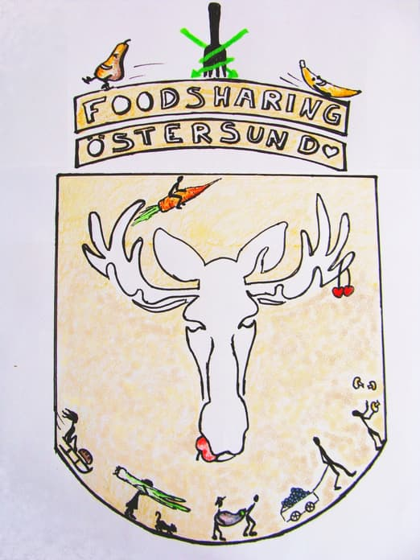
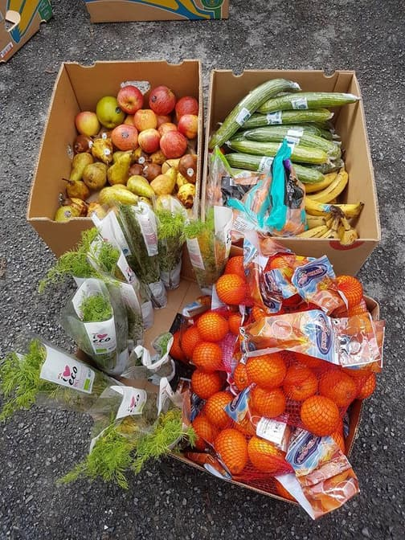
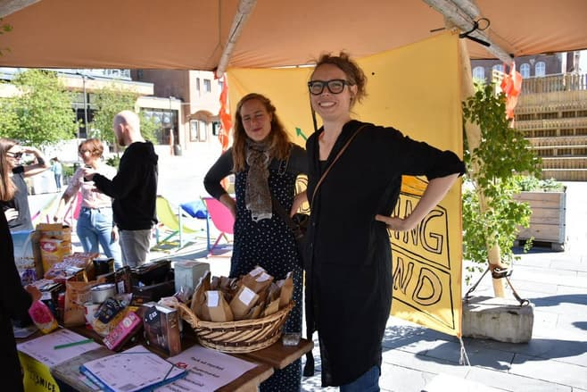

A few things about Foodsharing in Östersund (Sweden), how I started and what kind of challenges, ideas and projects we had so far. I’ll start and try to get some information together.

I started in February to share the idea of Foodsharing with people I knew, created a facebook group and held 2 meetings to inform people (only 4-6 ppl showed up). I also made a logo for Foodsharing Östersund (FSosd)
At the moment I am the main the person who plans, organises and has an overview. But this is slowly changing and developing. (I am from Germany and only in Östersund for 1 year to study there, I do not speak Swedish well and as I am leaving in January 2019, I am looking to make FSosd independent from me :D)

At the moment we have two running regular cooperations in Östersund.
One with a bakery (3x a week) and one with a supermarket “ICA” (3x a week)

## Communication
We communicate via 2 facebook groups, [one for everybody](https://www.facebook.com/FoodsharingOstersund/) and [one for people who are interested in doing some more organising](https://www.facebook.com/groups/194858781249133/). Also we use Telegram for last minute communication and karrot, as it has a chat function now, yay!!

## Managing pickups
From the beginning, all pickups were only available via [karrot.world](https://karrot.world). This is a good way to have an overview on how many people are actually active. Also it is a much better way of communication than Facebook.

## Problems
As the connection with people is mainly via internet (other than for example in Germany where you need to go to a meeting before you can do pickups officially) it is quite hard to convey the principles of foodsharing and to create a feeling of responsibility in the individual foodsavers. At the moment people more often just don't show up to a pick up.
We don't have any rules about what happens if somebody does not show up, as we also do not have a hierarchy really. I wonder how we can make this a little better, without creating a penalty system. or is it necessary? :frowning:

## Cooperation with other initiatives
A very big help for us is that some initiatives cooperate with FSosd and support us. [SMICE](https://www.smice.nu/single-post/2018/06/04/Food-Sharing-i-%C3%96stersund) and [Studieförbundet Vuxenskolan](https://www.sv.se/avdelningar/sv-jamtlands-lan/verksamhet/foodsharing-ostersund---vill-du-bidra-till-att-minska-matsvinnet-70031/) (SV) are our main partners. FSosd is a “study circle” at SV and they print posters and flyers for us. Also FSosd can be found on both websites.
Also we are in connection with [PUSHsverige](http://pushsverige.se/) (an initiative for young people that supports sustainable activism) and with a few others.

## Promotion
We had some events to promote Foodsharing:
- a brunch
- we screened the movie “just eat it” (in a community cinema, the screening license was donated by the producers after asking for it nicely)
- a sharing station at a one day festival in town (we managed to get 4 “one time cooperations” just for this event)
- I hold presentations on markets, events and where ever I can, through the cooperations with initiatives I get invited quite regularly now
- a [radio report about Foodsharing Östersund](https://sverigesradio.se/sida/artikel.aspx?programid=78&artikel=6949416) in Swedish

## Plans and Ideas
- a website for FSosd
- making FSosd a “förening” (official initiative, association) ?? Pros and Cons?
- getting more people on board to share the responsibilities
- having regular meetings?

_This article was first published as a forum post on the foodsaving worldwide community forums. The thread includes more statements from Teddy as well as other people and you can find it [here](https://community.foodsaving.world/t/foodsharing-oestersund-se-half-a-year-already/83).
