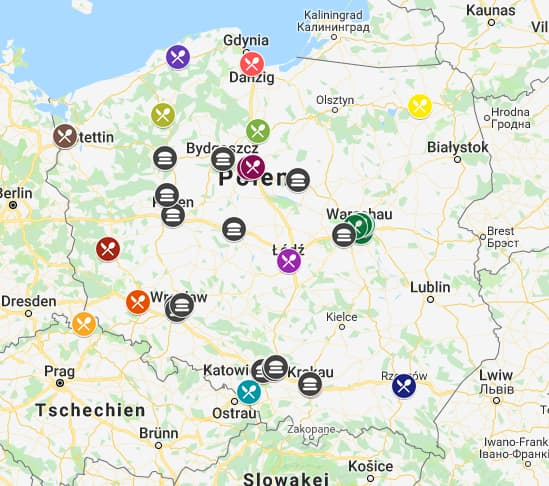
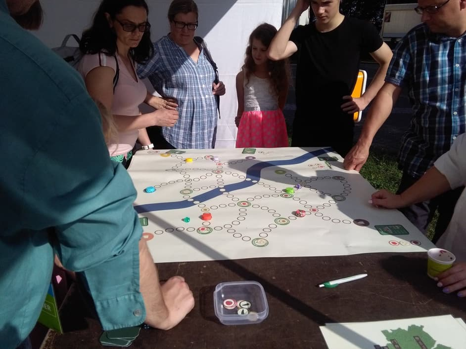
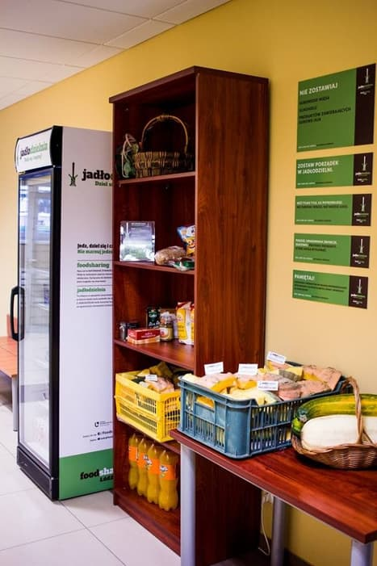
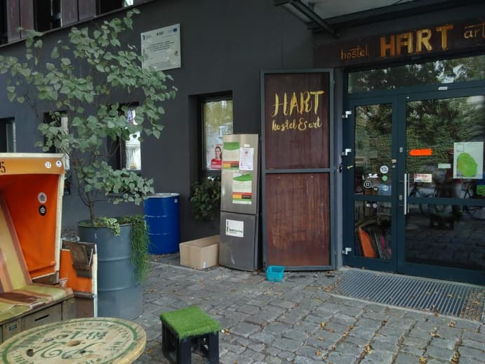

_This is a brief summary of Janina and Tilmann's trip to visit some Polish foodsharing groups in September 2018._

[Foodsharing in Warszawa is big](https://www.facebook.com/FoodsharingWarszawa/) – but as you can see in [this interactive map](https://www.google.com/maps/d/viewer?mid=1vpCSdHuflmBIw4WWV3VFCQ4L2sU) Poland has more active foodsavers than just those in the capital! Cities like [Kraków](https://www.facebook.com/foodsharing.krakow/) and [Toruń](https://www.facebook.com/jadlodzielnia.torun/) apparently have quite some people who dedicate a lot of time and energy to the cause of rescuing edible food from the bin, but also [Łódź](https://www.facebook.com/FoodsharingLodz/), [Wrocław](https://www.facebook.com/foodsharingwroclaw/) and more have their own foodsharing initiatives.

---

Foodsharing in Poland is mostly built on the concept of Food-Share Points. They coined the term 'Jadłodzielnia' which now is widely known and _the_ term for open fridges and stations where food can be shared. This is great! But it already got to the point where sometimes people know what 'Jadłodzielnia' is, but not about foodsharing. There have been local politicians trying to appropriate the term as well as the idea and use it for their own benefit without giving any credit to foodsharing and its volunteer activists.

Many people associate Food-Share Points with charity and think that it's mainly homeless people who (are meant to) take food from them. The main goal of waste reduction in general and foodsaving in particular is still not very known to the majority of people – like it is the case in many places.

_The Polish foodsavers keep their map of Food-Share Points always up-to-date_

[Foodsharing Polska](https://www.facebook.com/FoodsharingPolska) started in Warszawa almost 3 years ago. Today they have 11 Jadłodzielnia and around 100 pickups every week. They started using [Karrot](https://karrot.world) to manage their activities not too long ago and are now actively contributing to improving our foodsaving administration software.

Of course they also participate in public events and raise awareness for the topic of food waste and how foodsharing can help alleviate its consequences. For that purpose they recently made a nice game in which players are given recipe cards and then need to find and share the ingredients in Jadłodzielnia to prepare the meal. The locations roughly match those in reality and the feel of the game is very professional: It's printed on sturdy foil and its cards and coins are exactly as you would expect them in a high-quality board game.

_Games are great to engage people!_

In Łódź we met Agnieszka and Justyna who have been two main driving forces behind the foodsharing initiative in their city. Since almost two years they work on raising awareness for food waste, recruiting volunteers, doing pickups and maintaining their Jadłodzielnia which is located in the university, faculty of economics and sociology. They have been in contact with other student groups and tried to build a real-life community from their buzzing facebook group, but so far success is very limited.

Both are quite frustrated with the lack of understanding and engagement they encountered. "People seem to think that we run some kind of service" Agnieszka says, "One time we posted a picture of our Jadłodzielnia filled with vegetables and one person just commented that we should not put tomatoes in a fridge. What to do with this kind of people?". "We both have jobs" Justyna adds "and we can't do all this on our own all the time."

They have a facebook group for volunteers but rarely find support in there, so their next step is to call for a real-life meeting and find out who actually is interested in getting involved and who is just a digital relic that should be removed. With more clarity, overview and physical meetings they hope to turn things around and finally form a bigger group of core activists.

_The Jadłodzielnia in Łódź_

In Wrocław the situation is pretty unique: There is [another organization](http://wezpomoz.pl/) in the city that puts Jadłodzielnia everywhere but doesn't really work on filling them. Maciek and the foodsavers we met up with told us that there is some cooperation between the two groups, but also a lot of confusion and doubt. The other organization apparently has a more charity-like approach and access to some serious funding. They're happy for foodsharing to run the fridges, but they're not mentioning them anywhere.

Understandably, the foodsharing people in Wrocław are torn in their opinion on this situation: Is it a blessing or a curse? Who is stealing whose credit? Does it even matter what name is used when more food can be saved? But what about the focus on fighting food waste instead of providing a service? These are interesting circumstances and in general foodsharing Wrocław looks positively into the future.

_The only Jadłodzielnia with foodsharing logo in Wrocław_
