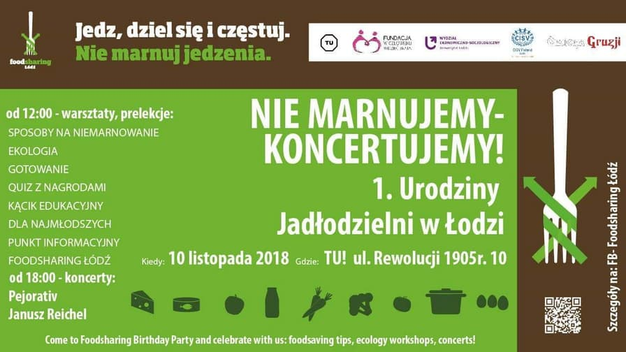
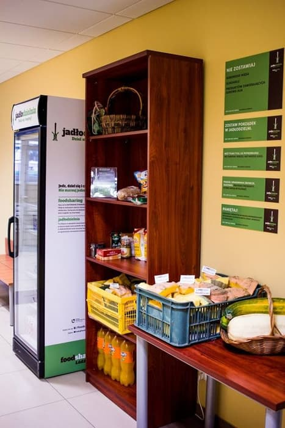

A great event took place on November 10 because of the first anniversary of the food share point in Łódź. Agnieszka Laskowska and Anna Dolinska promote the event and give us a look behind the scenes of [foodsharing Łódź](https://www.facebook.com/FoodsharingLodz) in their [radio interview](https://www.radiolodz.pl/broadcast_posts/48304-pierwsze-urodziny-lodzkiej-jadlodzielni-jestem-eko).

Last Saturday you could join different workshops, lectures or live cooking classes to learn about foodsharing and how to prevent food waste. Not only children, also grown-ups had fun with different educational games. One of the many highlights was the concert in the evening. The most impressive fact probably is that this all-day event was organized voluntarily besides a full-time job - just as the whole foodsharing movement in Łódź. Thanks to the student initiative and a lot of work that was put in, one year go the food share point could open in the university building.

_Flyer for the event_

There is still a lot of work to do to spread the news. Promoting the food share point is the first task to start with, to let more people know about this possibility. Although it is a located in a university building, it is free to use for everyone. People are warmly invited to visit!

Furthermore, volunteers are needed to organize pickups from stores and educate people about reducing food waste. Although people tend to be quite busy in their daily lifes, Agnieszka and Anna strongly believe that it’s possible to find time to spend on a good cause. And the topic is urgent: food waste is a huge problem not only in Poland but in the whole world and we face it every day.

Each good idea needs time. Joining the foodsharing group, having a feeling of community and facing the problems together is a powerful drive for this young movement. Everyone can join and can find the task that is most suitable for them: you can pick up food from local restaurants and stores as a so-called foodsaver, promote the food share point, do educational work or organize events like the anniversary celebration mentioned above. Even foreign students joined the foodsharing group already.

_Food share point in Łódź_

Agnieszka and Anna also observe some difficulties but show understanding for a lack of involvement. In a vibrant city like Łódź, foodsharing is not the only initiative to choose from. Also the life of a student has changed. Agnieszka admits that she barely knows anyone who doesn’t have a job besides studies. A more general problem is the decrease in appreciation of food, as people get more prosperous and wasting food becomes a life-style. On the other side people might get stigmatized for taking food out of the food share point. With their activities Agnieszka, Anna and more volunteers of foodsharing try to overcome these problems and fight against food waste.
