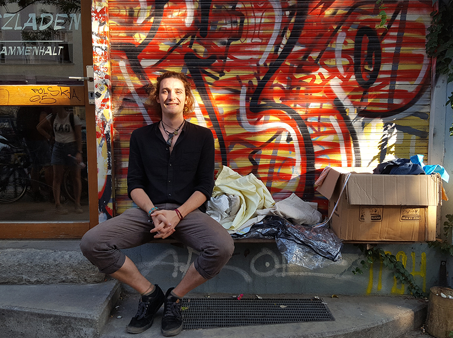
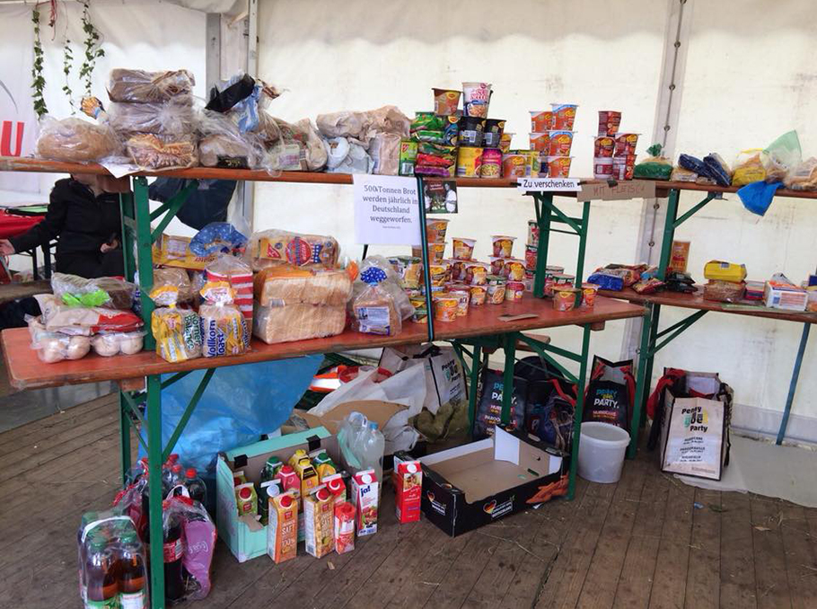
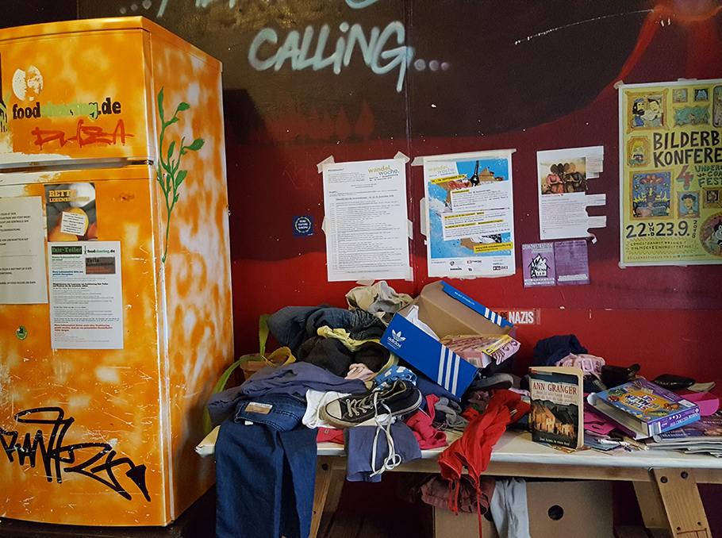
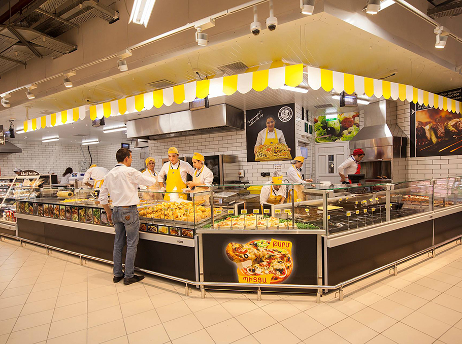
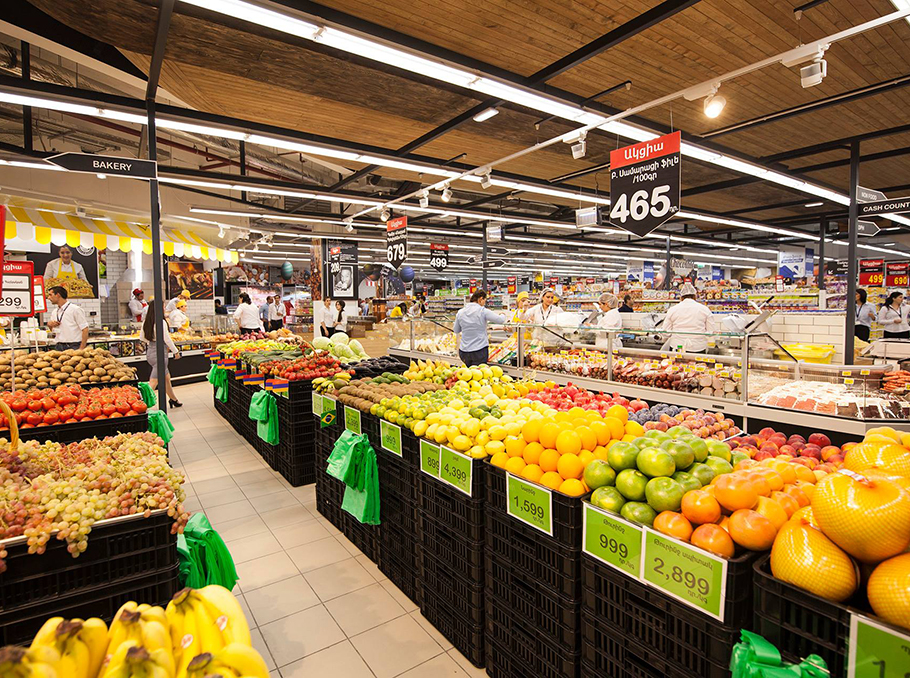
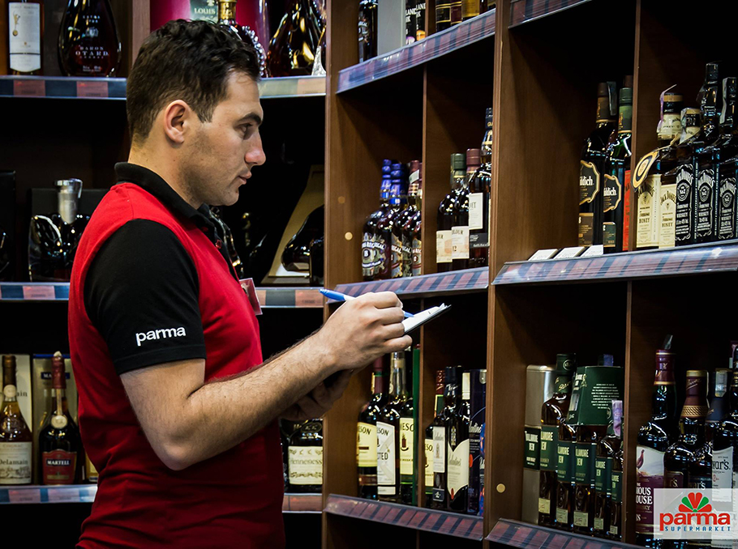
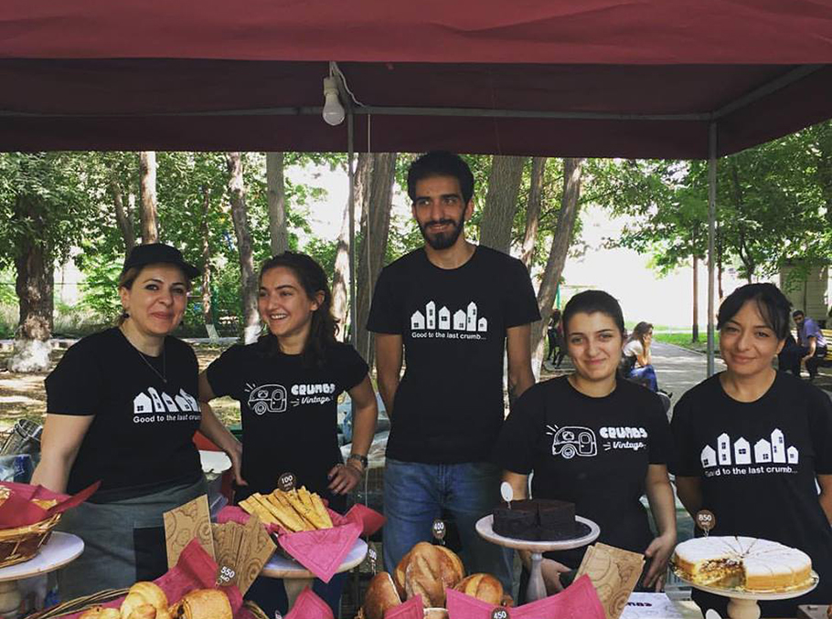
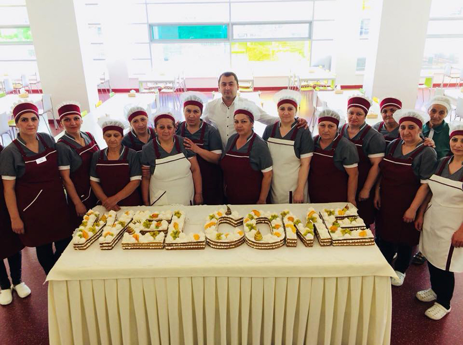

*Dieser Artikel wurde am 15. November 2018 von Mediamax veröffentlicht. [Hier Klicken](https://mediamax.am/am/news/special-report/31179/) um das armenische Original zu lesen. Alle Bilder sind dem Artikel entnommen. Übersetzung und Wiederveröffentlichung mit freundlicher Genehmigung des Autors Amalie Khachatryan. Es wurde keine Urheberrechtsverletzung beabsichtigt!*

# Die Lebensmittelverschwendung und die Idee von Foodsharing

*Haben Sie sich jemals gefragt, was mit den Essensresten passiert, die wir in einem Restaurant oder Café bestellen? Oder wo man die Produkte findet, die aus dem Supermarktregal nach ein paar Tagen verschwinden, ohne verbraucht zu werden? Mediamax versuchte herauszufinden, was die armenischen Lebensmittelerzeugung-, Verarbeitungs- oder Einkaufszentren zu bieten haben in Bezug auf Lebensmittelüberschüße, und welche Möglichkeiten es gibt die Lebensmittel noch zu nutzen.*

Bevor wir die Lage in Armenien untersuchen, sollten wir uns die internationale ansehen. Vor 7 Jahren begann die Foodsharing-Bewegung in Berlin nicht frische, aber auch nicht alte, Lebensmittel weiter zu verteilen, um zu verhindern das sie verschwendet werden. To compare the European and Armenian experience, we talked with members of foodsharing and several Armenian companies to find out if alternative solutions are available in Armenia.

## In Germany

We had a meeting with 20-year-old Max Fioravanti, a volunteer of the foodsharing movement in Berlin. Before telling us about the movement, Max proudly points out that he joined foodsharing in the beginning of this year and already saved over 200 kg of food. The food he saved got redistributed to friends and needy people. Max is a student and lives alone in Berlin. He almost always eats the surplus food from special occasions and does pickups at cafes and shops. In the morning, we are greeted with free croissants from yesterday. They are not fresh, but they are not old enough to count as trash. Still, the café would throw them out in the morning and prepare new ones.

"Maybe it's stupid, but I can not watch how the food is thrown away. I have been to Cambodia and have seen how the children are starving in the street, while in the hotel 4 km away half of the food prepared is just thrown away. It does not matter if it's 4 or 4000 km distance, we should not allow it." says Max, when explaining the idea and background of foodsharing.

## What is foodsharing?

Foodsharing is a volunteer organization that aims to fight food waste everyday. They offer companies to make their surplus food available for pickups by members of the movement instead of throwing it away. They will share it with people who cannot afford to buy it, or with anybody who wants to use that product.

It all started with the creators of the documentary film 'Taste the Waste'. Since 2011, the people behind that movie are connecting other people who are concerned about the topic of food waste. They raise funds, organize campaigns, and eventually sum up everyone's programs on foodsharing.de. Foodsharing today also operates in Austria and Switzerland, and it extends to other European countries, including Denmark, Poland and the Netherlands. 6,000 volunteers have joined the movement in Berlin only and more than 100 stores cooperate in the German capital.

By the way, if other similar movements only cater to people in need, foodsharing's expired food is also aimed at so-called normal people. They are not focused on helping needy people; foodsharing's idea is to save food from being wasted and it does not matter who will use that food.

## How Foodsharing works

Volunteers collaborate with stores, networks, food makers, or wholesalers. Foodsharing is committed to taking on all responsibility, that is, food providers are not responsible for any possible consequence of the consumption of the food.

An exact time for picking up the food is agreed upon. This kind of cooperation is a win for different kinds of people: those who cannot afford this food, as well as those who worry about having a stable society with minimal waste. After taking the food at the agreed time, the volunteers will divide the food upon themselves, distribute it or place it in public refrigerators in different parts of the city.

In Berlin, there are refrigerators available in several parts of the city, from which everyone can take still edible food or leave their own surplus.

## *Maybe also in Armenia*

## Carrefour supermarket

"There is a huge amount of food every month. Food waste is divided into two categories: the first is when the expiration date is passed, the other when the product is still before the date but does not look appropriate for sale. The main foodstuff that goes to waste is fresh food: baked goods, cake, fruit, vegetables, meat products, fish, dairy products, homemade dishes. This is our daily waste twice a day." Mediamax was told by a representative of the Carrefour Armenia supermarket for Carrefour International.

All expired products in the hypermarket end up in the trash and get destroyed before they are thrown away. "If we simply throw it in the trash, people will take it and sell it right away, and we do not sell our garbage," said Carrefour spokesman and added "There was an experience with Carrefour in one country, where we have been giving our surplus to organizations fighting against waste, but, unfortunately, afterwards we found these products on the market. That's why we are no longer cooperating with any organization. There are countries where Carrefour gives food waste to farmers as animal feed. In Armenia we have received such offers from the villagers, but we have not accepted them. And if we want to do charity, we'll give people fresh produce."

When talking about work with Armenian suppliers, Carrefour says most of the surplus goods cannot be returned and the supermarket has to take care of waste management. Only the dairy producers are employed on return basis.

## Parma supermarket

Unlike Carrefour, a Parma supermarket representative says any product that appears in the supermarket, has its own supplier, manufacturer or importer, and 95% of the suppliers work on a return basis. 1 week or 1 day before the expiration date, depending on the arrangement, the product is returned to the supplier. What then happens to the food, the supermarket is unaware of.

Fresh salads and hot dishes are sold every day at 8 pm, and the cakes are sold for several days, depending on the ingredients.

"We have very small quantities of foodstuffs and the permitted amount of waste - which is food that cannot be sold anymore the next day - is being dumped and thrown out to the garbage." says Chief of Staff at the Northern Avenue of Parma Supermarket, Food Quality Control Officer Naira Khachatryan.

He informs that the waste counts as tax expense and will be deducted from certain tax liabilities. "Naturally, the entrepreneur would prefer to get rid of tax liabilities and to show the waste to the relevant bodies rather than to do charity. Theoretically, the idea of ​​the Foodsharing movement is very good, but in practice it is necessary to develop serious mechanisms that will benefit both sides, both the state and the entrepreneur.

In order for a supermarket to be able to offer such a service in a way that is profitable, it is necessary to get some tax benefits, otherwise the supermarket itself will not be able to give free or discounted goods to any organization after 8 pm, says the Parma representative.

## Crumbs The Bread Factory - Cafe and shop

"We have never wasted food. We have always been aware of the fact that there are people who live in hunger. Twice a week we send our leftover products that have been preserved and can still be used to orphanages and other shelters for people in need" said Rosa Gharibyan, Crumbs Deputy Director.

At Crumbs café, avoiding waste really is a core task: leftover apples and apple juice gets transformed into apple cider vinegar, the food that is not finished by the customers gets collected and given to animals.

"If we have a surplus of egg protein, we use it just like egg, add sugar, cook it in the oven and turn it into nice food which we then give to children's homes and the poor. I have seen how this protein gets wasted in many places when the packaging is damaged." says Crumbs' deputy director.

Crumbs sells their cookies over the period of some days, and after the expiration date, they get eaten by morning cuisine workers.

"We might be the only partners but we'll happily cooperate with such food-saving initiatives. We don't handle as much food as a supermarket and thus don't have a similar big impact on the problem as a whole. But on the other hand, 20 of our cafes can easily make up for more than one supermarket." says Roza Gharibyan.

## Yeremyan Projects ("Tavern Yerevan", "Lavash", "Sherep" restaurants)

Food collectors at Yeremyan Projects do not have much to do because food in their restaurants will not simply become garbage. According to PR head Anahit Gevorgyan, all food surplus is used purposefully: Leftovers are transported to the village of Avan where they are used to feed animals. Damaged or imperfect fruit and vegetables will be used in the enterprise's own factory, for example to make tomato paste from such tomatoes.

"The problem of large quantities of food waste also exists in Armenia, but we have found a solution to this problem by creating our own factory and farming point. Still, if there were organizations that take the food in the whole city and use it purposefully, maybe we would cooperate with them." says Anahit Gevorgyan.

## Art Lunch canteens

Despite the fact that at the 40 Art Lunch canteens food surplus is not much, they are constantly on the lookout, Art Lunch founder Bakur Melkonyan says if a food waste initiative is created in Armenia, they will definitely agree to cooperate. But it also notes that there are a number of important issues that need to be taken into consideration.

Food that did not consumed on time, lost its freshness and became a potential health risk will be eaten by Art Lunch's own pig breed.

"When we close at 6 pm, we check what can still be used. We might give it to initiatives fighting against food waste, but it needs to be consumed quickly, because otherwise it will go bad." Melkonyan says.

He sees the idea to make fertilizer from food waste and scraps as the perfect solution: "Once we were approached by young people with the plan to get more food or fuel from the food, but as far as I know, the program did not continue. In case such a project restarted it could work perfectly with us. We give the food waste, the organization gives the fertilizer to the villagers to cultivate the land, and we will buy the product of the villager." says the Art Lunch founder.

## "Tamara", "Atenk", "SAS", "Nor Zovk"

Tamara dairy and confectionery company did not want to talk to us about food waste. The company representative only mentioned that they completely destroy the surpluses from the stores because they consider it risky to donate the expired food and keep on using it in foodsaving initiatives.

We also contacted "Atenk" meat-processing company, "SAS" and "Nor Zovq" supermarkets, but did not manage to get a comment from them.