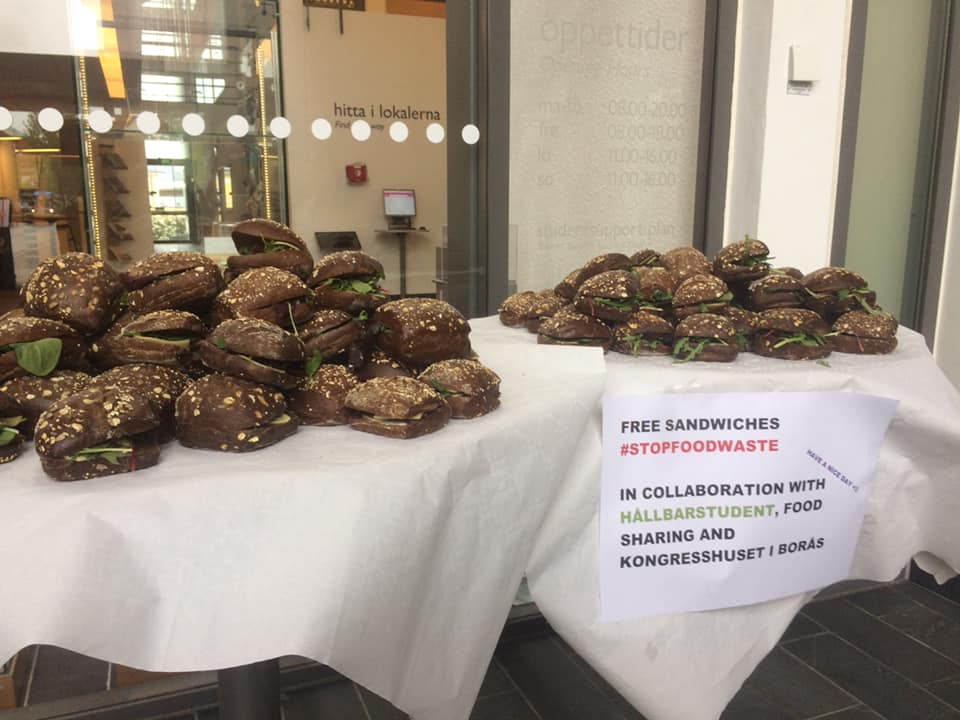
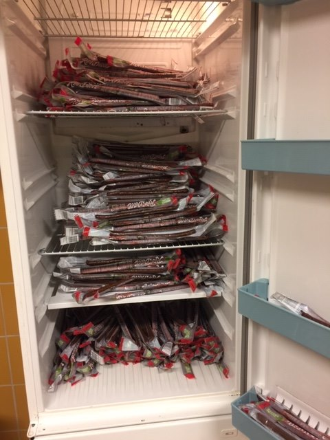
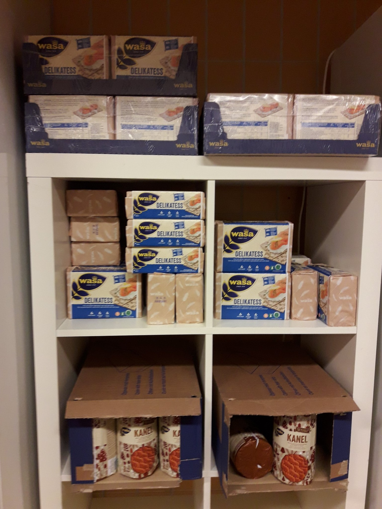
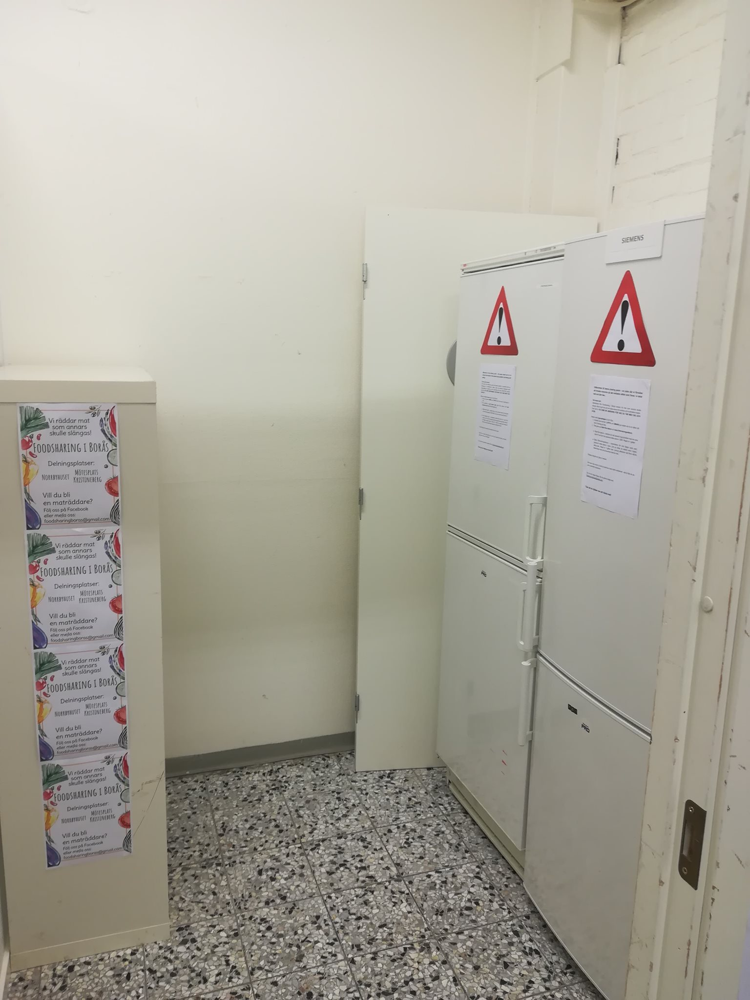
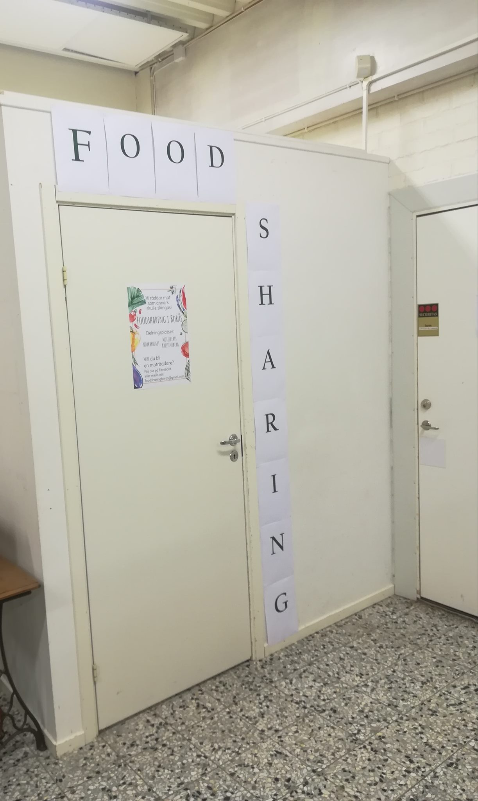

Foodsharing i Borås counts its second year of activity already. I am really proud of this, especially having in mind that we had a very good chance of dying in the very beginning while we were just forming the initial group. This is because the foodsharing pioneer in Borås – Lotta from Germany who was at that time staying in the city for a volunteering project – left us soon after she arranged a couple of introductory meetings.

Yeah, she presented the idea and shared her own experience in saving food – and left. I don’t blame Lotta for anything, quite the opposite, she inspired us to start foodsharing in Borås, but when she left, we felt rather lost – I mean, there were like 2 or 3 of us back then and neither of us knew what exactly we were supposed to do to get this going.

To be honest, I wouldn’t say that we know what we are supposed to do now. It’s learning by doing all the way – how to get in contact with stores, how to communicate internally and externally, how to organize pickups or how to maintain sharing points. Neither of us is an expert in these things and we probably have done plenty of mistakes (and will surely continue doing them).

But. This is what we have today:

- 2 active sharing points;
- 1 regular co-operation;
- 1 regular co-operation that we allow ourselves not to care about because they don’t seem to get the idea behind foodsharing and thus mostly (but not explicitly) give us rotten fruits and vegetables;
- 1 ex-co-operation – a school in Borås that used to give us prepared meals but then had to decline us due to orders from the municipality;
- 1 irregular co-operation that can contact us at any time and give us a few hundreds of sandwiches;
- Unclear number of one-time cooperations – various organisations just happen to know about foodsharing and thus contact us in case they have food left after some events or arrangements;
- Unclear number of private persons who use the fridge not only to take but also to give – there is almost always food in our sharing points that was not delivered by us. It’s not much food, but it’s enough to make my heart warm. 

You may think these numbers are rather modest. And I agree, we could have done so much more during one year. But at the same time I think these numbers are impressive, given that so far we have been only a very few active people who made this happen. The same people have been doing everything, that is, not only looking for co-operations, trying to find the right places for sharing points and attending various events to promote foodsharing, but also doing pickups, sorting food, transporting fridges from one place to another and so on. Most of us have full-time jobs, studies, families or some of these things combined. 

It seems that the number of volunteers is now growing – people are probably more keen to do pickups when they see we have something regular going on. Which also make us feel more confident in looking for new co-operations. We even feel ambitions enough to become an association (förening) which would potentially enhance our status and provide some opportunities for financial support. All in all, if the future of Foodsharing i Borås was rather dull one year ago, everything seems so much brighter today. 

/Danu

